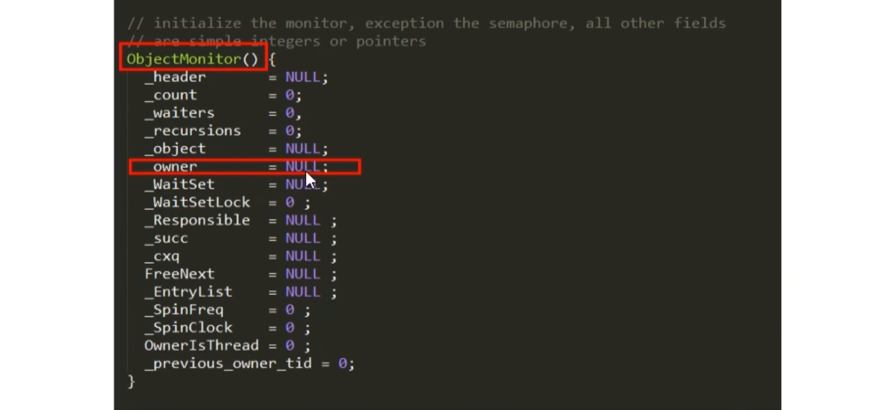
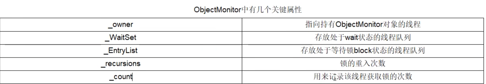

### 1、Redis的删除策略是怎么做的？

首先我们在redis存储数据时，可以设置expireTime，或者根据业务需求手动删除(这样的回答是不可取的)。\
首先，在redis中数据过期是通过设置过期事件来进行数据删除的，这个时候我们需要考虑到更为复杂的场景：\
场景1：缓存雪崩，如果key设置的过期时间过于集中，Redis可能出现卡顿，严重的话可能，可能会导致数据库宕机，从而引起一系列的连锁问题。
解决方案：\
1、将key的过期时间后面加上一个随机数\
2、热点数据可以考虑不失效\
3、构建缓存高可用集群\
场景2：缓存击穿：缓存雪崩是指只大量热点key同时失效的情况，如果是单个热点key，在不停的扛着大并发，在这个key失效的瞬间，持续的大并发请求就会击破缓存，直接请求到数据库，好像蛮力击穿一样。这种情况就是缓存击穿（Cache
Breakdown）\
1、设置热点数据不过期\
2、监控过期时间，快过期的时候更新数据库数据\

### 2、为什么每个对象都能成为锁？

每个对象天生都带着一个对象监视器，每个被锁住的对象都会和Monitor关联起来。ObjectMonitor含有owner属性，哪个线程持有这个对象就会设置owner的值。

### 3、什么是管程monitor ？

管程是一种数据结构，结构内有多个子程序（对象或者模块）形成多个工作线程互斥访问的共享资源。这些资源一般是硬件设备或者一堆变量。对这些共享变量最好是集中再一个模块中。
（把信号量及操作原语封装在一个对象内部），管程实现了在一个时间点，最多只有一个线程在执行管程中的某个子程序。管程提供了一种机制，管程可以看作是一个软件模块。
它是将共享的变量和对于这些共享变量的操作封装起来，形成一个具有接口的功能模块，进程可以调用管程来实现进程级别的并发控制。

### 4、常用的SQL优化有哪些？

### 5、MySQL的锁有哪些
