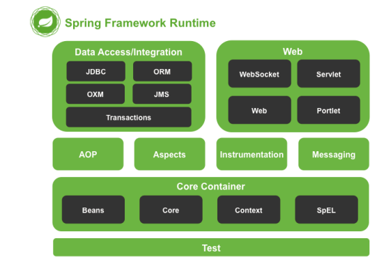
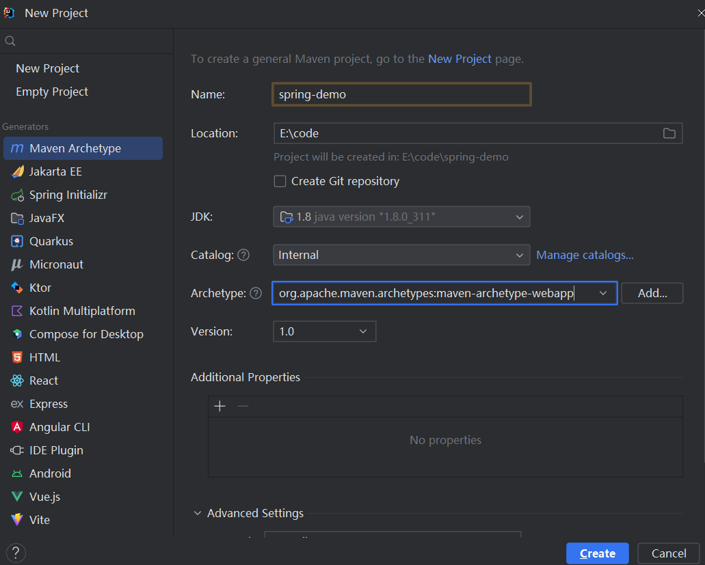
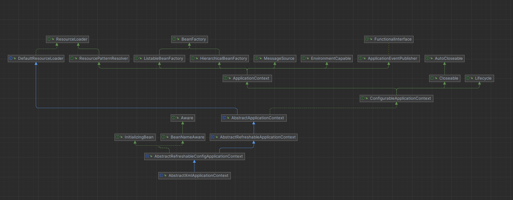
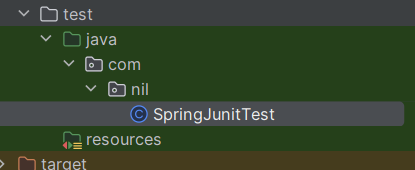

## Spring框架学习笔记

### 1.spring简介

#### 1.1 什么是spring？

Spring是分层的Java SE/EE应用full-stack的轻量级框架，以IOC(Inverse of Control:控制反转)和AOP(Aspect Oriented
Programming：面向切面编程)为内核

提供了展现层Spring MVC和持久层Spring JDBCTemplate以及业务逻辑事务管理等众多企业级应用技术，还能整合开源世界众多著名的第三方框架和类库，逐渐成为使用最多的Java
EE企业应用开源框架。

#### 1.2 spring的发展历程

1997年，IBM提出了EJB的思想。
1998年，SUN制定了开发标准规范EJB1.0
1999年，EJB1.1发布
2001年，EJB2.0发布
2003年，EJB2.1发布
2006年，EJB3.1发布

#### 1.3 spring的优势

1）方便解耦，简化开发
通过spring提供的IOC容器，可以将对象见的依赖关系交由spring控制，避免硬编码所造成的过度耦合。用户不必在为单例模式类、属性文件解析等这些很底层的需求编写代码，可以更专注应用上层的应用。
2）AOP编程的支持
通过spring的AOP功能，方便进行面向切面编程，许多不容易用传统OOP实现的功能可以通过AOP轻松实现。
3）声明式事务的支持
可以将我们从单调烦闷的事务管理代码中解脱出来，通过声明式方式灵活的进行事务管理，提高开发质量和效率。
4）方便程序的测试
可以用非容器依赖的编程方式进行几乎所有的测试工作，测试不再是昂贵的操作，而是随手可做的事情。
5）方便集成各种优秀框架
Spring对各种优秀框架(struts、Hibernate、Quartz)的支持。
6）降低了Java EE API使用难度
Spring对Java EE进行了薄薄的封装层，让使用这些API的难度大大降低。
7）Java源码学习的典范

### 2.spring的体系结构



### 3.spring快速入门

#### 3.1 创建maven项目



#### 3.2 引入依赖pom.xml

```xml

<project xmlns="http://maven.apache.org/POM/4.0.0" xmlns:xsi="http://www.w3.org/2001/XMLSchema-instance"
         xsi:schemaLocation="http://maven.apache.org/POM/4.0.0 http://maven.apache.org/maven-v4_0_0.xsd">
    <modelVersion>4.0.0</modelVersion>
    <groupId>com.nil</groupId>
    <artifactId>spring-demo</artifactId>
    <packaging>war</packaging>
    <version>1.0-SNAPSHOT</version>
    <name>spring-demo Maven Webapp</name>
    <url>https://maven.apache.org</url>
    <dependencies>
        <dependency>
            <groupId>org.springframework</groupId>
            <artifactId>spring-context</artifactId>
            <version>6.0.13</version>
        </dependency>
        <dependency>
            <groupId>junit</groupId>
            <artifactId>junit</artifactId>
            <version>3.8.1</version>
            <scope>test</scope>
        </dependency>
    </dependencies>
    <build>
        <finalName>spring-demo</finalName>
    </build>
</project>

```

#### 3.3 在配置文件中配置UserService的实现

```xml
<?xml version="1.0" encoding="UTF-8"?>
<beans xmlns="http://www.springframework.org/schema/beans"
       xmlns:xsi="http://www.w3.org/2001/XMLSchema-instance"
       xsi:schemaLocation="http://www.springframework.org/schema/beans http://www.springframework.org/schema/beans/spring-beans.xsd">

    <bean id="userService" class="com.nil.service.impl.UserServiceImpl"/>
</beans>
```


#### 3.4 使用spring的API获取bean实例

```java
package com.nil.main;

import com.nil.service.UserService;
import org.springframework.context.ApplicationContext;
import org.springframework.context.support.ClassPathXmlApplicationContext;

/**
 * @author tangsx
 * @createTime 2023/11/19 22:58
 * @description
 */
public class Main {
    public static void main(String[] args) {
        ApplicationContext context = new ClassPathXmlApplicationContext("applicationContext.xml");
        UserService userService = (UserService) context.getBean("userService");
        System.out.println(userService);
        userService.addUser();
    }
}

```

```shell
com.nil.service.impl.UserServiceImpl@72d818d1
add user==============

Process finished with exit code 0

```

### 4.spring配置文件详解

#### 4.1 bean标签的基本配置

用于配置对象交由spring来创建。\
默认情况下它调用类中的无参构造函数，如果没有无参构造则不能创建成功。\
基本属性\
id:Bean实例在Spring容器中的唯一标识\
class：类的全限定名称

#### 4.2 bean标签范围配置

scope：指对象的作用范围

| 取值范围           | 说明                                                          |
|:---------------|-------------------------------------------------------------|
| singleton      | 默认值，单例的                                                     |
| prototype      | 多例的                                                         |
| request        | Web项目中创建一个bean对象，将对象存入到request域中                            |
| session        | Web项目中创建一个bean对象，将对象存入到session域中                            |
| global session | Web项目中，应用在portlet环境，如果没有portlet环境那么global session相当于session |

##### 4.2.1 当scope的取值为singleton时

Bean的实例化个数：1个\
Bean的实例化时机：当bean配置成singleton，核心配置文件一旦被加载，bean被实例化。\
Bean的生命周期：\
对象创建：当应用加载时，创建容器时，对象就被创建了\
对象运行：只要容器在，对象一直活着\
对象销毁：当应用卸载时，销毁容器时，对象就被销毁了

##### 4.2.2 当scope取值为prototype时

Bean的实例化个数：多个\
Bean的实例化时机：当调用getBean()方法时实例化bean。\
Bean的生命周期：\
对象创建：当使用对象时，对象就被创建了\
对象运行：只要对象在使用中在，对象一直活着\
对象销毁：当对象长时间不用时，就被Java的垃圾回收器回收了

#### 4.3 关于bean声明周期配置

- init-method 初始化方法
- destroy-method 销毁方法

#### 4.4 bean的实例化三种方式

- 无参构造方法实例化
- 工厂静态方法实例化
- 工厂实例方法实例化

#### 4.5 bean的依赖注入分析

目前userDao和userService都存在于spring容器中，在容器外部获得userDao和userService实例，然后在程序结合。\
因为userDao和userService都存在于spring容器中，所以在容器中，将userDao设置到userService内部。\
两种方式：setter方法 构造注入\
依赖注入概念：Dependency injection:  它是spring框架核心IOC的核心。\
在编写程序时，通过控制反转，把对象的创建交给spring，但是代码不可能出此案没有依赖的关系。IOC只是降低他们的依赖关系，但不会消除。例如：业务层仍会调用持久层的方法。

这种依赖关系，交给spring维护。\
简单的说，就是坐等框架把持久层对象传入业务层，而不用自己获取。\

- setter方法注入
- 构造注入

#### 4.6 p命名空间

#### 4.7 bean的依赖注入的数据类型

#### 4.8 分模块开发


### 5 spring的相关API



- ClassPathXmlApplicationContext\
类路径地址
- FileSystemXmlApplicationContext\
文件系统地址
- AnnotationConfigApplicationContext\
基于出注解

### 6 spring配置数据源

数据源的作用：

数据源是提高程序性能出现的\
事先实例化数据源，初始化部分连接资源\
使用资源时从数据源获取\
使用完毕后将连接资源还给数据源

常见的数据源：DBCP C3P0 Druid

### 7、spring注解开发

Spring是轻代码而重配置的框架，配置比较繁重，影响开发效率，所以注解开发是一种趋势，注解替代配置xml可以简化配置，提升开发效率。

Spring原始注解主要替代bean标签

| 注解             | 说明                     |
|:---------------|------------------------|
| @Component     | 使用在类上实例化bean           |
| @Controller    | 使用在web层类上实例化bean       |
| @Service       | 使用在service层类上实例化bean   |
| @Repository    | 使用在dao层上用于实例化bean      |
| @Autowired     | 使用在属性上根据类型依赖注入         |
| @Qualifier     | 结合@Autowired一起根据名称进行注入 |
| @Resources     | 按照名称进行注入               |
| @Value         | 注入普通属性                 |
| @Scope         | 标注bean的作用范围            |
| @PostConstruct | Bean的初始化方法             |
| @PreDestroy    | Bean的销毁方法              |

Spring的新注解\
使用上面的注解还不能完全替代xml配置文件\
非自定义bean的配置\
加载properties文件的配置\
组件扫描的配置\
引入其他文件

| 注解               | 说明                                  |
|:-----------------|-------------------------------------|
| @Component       | 使用在类上实例化bean                        |
| @Configuration	  | 用于指定当前类是一个spring配置类，当创建容器时从该类上加载注解。 |
| @ComponentScan	  | 用于指定spring在初始化容器时要扫描的包。             |
| @Bean	           | 使用在方法上，标注将该方法的返回值存储到spring容器        |
| @PropertySource	 | 加载.properties文件中的配置                 |
| @Import	         | 用于导入其他配置类                           |

### 8、spring集成junit单元测试

- pom.xml
```xml
<project xmlns="http://maven.apache.org/POM/4.0.0" xmlns:xsi="http://www.w3.org/2001/XMLSchema-instance"
         xsi:schemaLocation="http://maven.apache.org/POM/4.0.0 http://maven.apache.org/maven-v4_0_0.xsd">
    <modelVersion>4.0.0</modelVersion>
    <groupId>com.nil</groupId>
    <artifactId>spring-demo</artifactId>
    <packaging>war</packaging>
    <version>1.0-SNAPSHOT</version>
    <name>spring-demo Maven Webapp</name>
    <url>https://maven.apache.org</url>
    <dependencies>
        <dependency>
            <groupId>org.springframework</groupId>
            <artifactId>spring-context</artifactId>
            <version>5.3.29</version>
        </dependency>
        <!-- spring test -->
        <dependency>
            <groupId>org.springframework</groupId>
            <artifactId>spring-test</artifactId>
            <version>5.3.30</version>
        </dependency>
        <!-- spring test -->
        <dependency>
            <groupId>junit</groupId>
            <artifactId>junit</artifactId>
            <version>4.11</version>
            <scope>test</scope>
        </dependency>
    </dependencies>
    <build>
        <finalName>spring-demo</finalName>
    </build>
</project>

```

- Test case demo



```java
package com.nil;

import com.nil.service.UserService;
import org.junit.Test;
import org.junit.runner.RunWith;
import org.springframework.beans.factory.annotation.Autowired;
import org.springframework.test.context.ContextConfiguration;
import org.springframework.test.context.junit4.SpringJUnit4ClassRunner;

@RunWith(value = SpringJUnit4ClassRunner.class)
@ContextConfiguration(locations = {"classpath:applicationContext.xml"})
public class SpringJunitTest {

    @Autowired
    private UserService service;

    @Test
    public void test() {
        service.addUser();
    }
}
```
