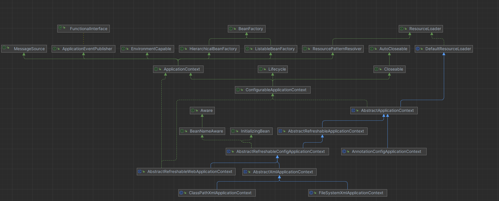

## 2.Spring源码分析

### 1、类图



### 2、代码

- 1、创建spring-Bean工厂ApplicationContext

```java
package com.nil.main;

import com.nil.service.UserService;
import org.springframework.context.ApplicationContext;
import org.springframework.context.support.ClassPathXmlApplicationContext;

/**
 * @author tangsx
 * @createTime 2023/11/19 22:58
 * @description
 */
public class Main {
    public static void main(String[] args) {
        ApplicationContext context = new ClassPathXmlApplicationContext("applicationContext.xml");
        UserService userService = (UserService) context.getBean("userService");
        System.out.println(userService);
        userService.addUser();
    }
}

```

- 2 ClassPathXmlApplicationContext 实例化，设置configLocations以及刷新方法

```java
public class ClassPathXmlApplicationContext extends AbstractXmlApplicationContext {

    /**
     * 实例化ClassPathXmlApplicationContext
     *
     * @param configLocation
     * @throws BeansException
     */
    public ClassPathXmlApplicationContext(String configLocation) throws BeansException {
        this(new String[]{configLocation}, true, (ApplicationContext) null);
    }


    /**
     * 有参构造
     *
     * @param configLocations configLocations
     * @param refresh refresh
     * @param parent parent
     * @throws BeansException BeansException
     */
    public ClassPathXmlApplicationContext(String[] configLocations, boolean refresh, @Nullable ApplicationContext parent) throws BeansException {
        super(parent);
        // 设置配置文件的位置
        this.setConfigLocations(configLocations);
        if (refresh) {
            // 调用父类AbstractXmlApplicationContext的refresh()方法完成BeanFactory的初始化和加载
            this.refresh();
        }

    }
}
```

- 3、this.refresh()调用的父类 AbstractApplicationContext的refresh()方法（当子类没有定义refresh方法时，this对象会寻求父类中的方法）

```java
public abstract class AbstractApplicationContext extends DefaultResourceLoader implements ConfigurableApplicationContext {


    public void refresh() throws BeansException, IllegalStateException {
        synchronized (this.startupShutdownMonitor) {
            StartupStep contextRefresh = this.applicationStartup.start("spring.context.refresh");
            /**
             * 容器创建前的准备工作
             */
            this.prepareRefresh();

            /**
             * 1、加载xml的属性值到当前工厂中
             * 2、解析配置文件并注册bean定义
             */
            ConfigurableListableBeanFactory beanFactory = this.obtainFreshBeanFactory();
            this.prepareBeanFactory(beanFactory);
            try {
                /**
                 * 此处为子类覆盖方法，不做任何处理，其他子类在实现时会做相应的操作
                 */
                this.postProcessBeanFactory(beanFactory);
                StartupStep beanPostProcess = this.applicationStartup.start("spring.context.beans.post-process");
                /**
                 * 调用BeanFactoryPostProcessor的postProcessBeanFactory的方法，对beanFactory做一些修改和定制
                 */
                this.invokeBeanFactoryPostProcessors(beanFactory);
                /**
                 * 注册bean后处理器，用于拦截bean的注册过程
                 */
                this.registerBeanPostProcessors(beanFactory);
                beanPostProcess.end();

                /**
                 * 初始化message源
                 */
                this.initMessageSource();

                /**
                 * 初始化事件监听广播器
                 */
                this.initApplicationEventMulticaster();

                /**
                 * 用来初始化特定子类的bean
                 */
                this.onRefresh();

                /**
                 * 在所有bean中查找Listener，注册到消息广播器
                 */
                this.registerListeners();

                /**
                 * 初始化剩下的所有单实例bean(非懒加载的)
                 */
                this.finishBeanFactoryInitialization(beanFactory);
                /**
                 * 完成刷新过程，通知LifecycleProcessor刷新过程，同时触发事件通知ContextRefreshedEvent
                 */
                this.finishRefresh();
            } catch (BeansException var10) {
                if (this.logger.isWarnEnabled()) {
                    this.logger.warn("Exception encountered during context initialization - cancelling refresh attempt: " + var10);
                }

                this.destroyBeans();
                this.cancelRefresh(var10);
                throw var10;
            } finally {
                this.resetCommonCaches();
                contextRefresh.end();
            }

        }
    }

    /**
     * 1、设置容器启动的时间
     * 2、设置活跃状态为True
     * 3、设置关闭状态为False
     * 4、获取Environment对象，并且加载当前系统的属性到系统中去
     * 5、准备监听器和事件的集合，默认为空的集合
     */
    protected void prepareRefresh() {
        this.startupDate = System.currentTimeMillis();
        this.closed.set(false);
        this.active.set(true);
        if (this.logger.isDebugEnabled()) {
            if (this.logger.isTraceEnabled()) {
                this.logger.trace("Refreshing " + this);
            } else {
                this.logger.debug("Refreshing " + this.getDisplayName());
            }
        }

        this.initPropertySources();
        this.getEnvironment().validateRequiredProperties();
        if (this.earlyApplicationListeners == null) {
            this.earlyApplicationListeners = new LinkedHashSet(this.applicationListeners);
        } else {
            this.applicationListeners.clear();
            this.applicationListeners.addAll(this.earlyApplicationListeners);
        }

        this.earlyApplicationEvents = new LinkedHashSet();
    }

    /**
     * 注册bean后处理器，用于拦截bean的注册过程
     *
     * @param beanFactory beanFactory
     */
    protected void registerBeanPostProcessors(ConfigurableListableBeanFactory beanFactory) {
        PostProcessorRegistrationDelegate.registerBeanPostProcessors(beanFactory, this);
    }

    /**
     * 获取ConfigurableListableBeanFactory对象
     *
     * @return ConfigurableListableBeanFactory instance
     */
    protected ConfigurableListableBeanFactory obtainFreshBeanFactory() {
        this.refreshBeanFactory();
        return this.getBeanFactory();
    }
}
```

- 4、refreshBeanFactory()
  ---调用的是父类AbstractXmlApplicationContext的父类AbstractRefreshableApplicationContext的refreshBeanFactory()方法

```java
public abstract class AbstractRefreshableApplicationContext extends AbstractApplicationContext {


    protected final void refreshBeanFactory() throws BeansException {

        // 首先检查BeanFactory方法是否已经被创建，如果已经创建则销毁当前的实例，并且关闭掉Bean工厂
        if (this.hasBeanFactory()) {
            this.destroyBeans();
            this.closeBeanFactory();
        }

        try {
            // 创建新的bean工厂，并将其设置为当前的bean工厂
            DefaultListableBeanFactory beanFactory = this.createBeanFactory();
            // 设置序列化id，以便于在序列化和反序列化时使用
            beanFactory.setSerializationId(this.getId());
            // 自定义bean工厂,设置相关属性，允许循环依赖
            this.customizeBeanFactory(beanFactory);
            // 加载配置文件、解析配置文件、默认命名空间的解析 解析XML配置映射为
            this.loadBeanDefinitions(beanFactory);
            this.beanFactory = beanFactory;
        } catch (IOException var2) {
            throw new ApplicationContextException("I/O error parsing bean definition source for " + this.getDisplayName(), var2);
        }
    }
}
```

- 5 this.loadBeanDefinitions(beanFactory) -> AbstractXmlApplicationContext.loadBeanDefinitions(
  DefaultListableBeanFactory beanFactory)

```java
public abstract class AbstractXmlApplicationContext extends AbstractRefreshableConfigApplicationContext {


    protected void loadBeanDefinitions(DefaultListableBeanFactory beanFactory) throws BeansException, IOException {
        XmlBeanDefinitionReader beanDefinitionReader = new XmlBeanDefinitionReader(beanFactory);
        beanDefinitionReader.setEnvironment(this.getEnvironment());
        beanDefinitionReader.setResourceLoader(this);
        beanDefinitionReader.setEntityResolver(new ResourceEntityResolver(this));
        this.initBeanDefinitionReader(beanDefinitionReader);
        this.loadBeanDefinitions(beanDefinitionReader);
    }

    protected void loadBeanDefinitions(XmlBeanDefinitionReader reader) throws BeansException, IOException {
        Resource[] configResources = this.getConfigResources();
        if (configResources != null) {
            reader.loadBeanDefinitions(configResources);
        }

        String[] configLocations = this.getConfigLocations();
        if (configLocations != null) {
            reader.loadBeanDefinitions(configLocations);
        }

    }
}
```

- 6 reader.loadBeanDefinitions(configResources);
  XmlBeanDefinitionReader的父类是AbstractBeanDefinitionReader，XmlBeanDefinitionReader没有重写这个方法，所有调用的是父类的loadBeanDefinitions(
  Resource... resources)方法

```java
public abstract class AbstractBeanDefinitionReader implements BeanDefinitionReader, EnvironmentCapable {

    public int loadBeanDefinitions(Resource... resources) throws BeanDefinitionStoreException {
        Assert.notNull(resources, "Resource array must not be null");
        int count = 0;
        Resource[] var3 = resources;
        int var4 = resources.length;

        for (int var5 = 0; var5 < var4; ++var5) {
            Resource resource = var3[var5];
            count += this.loadBeanDefinitions((Resource) resource);
        }

        return count;
    }
}
```

- 7 XmlBeanDefinitionReader调用自身的loadBeanDefinitions(EncodedResource encodedResource)方法

```java
public class XmlBeanDefinitionReader extends AbstractBeanDefinitionReader {

    public int loadBeanDefinitions(Resource resource) throws BeanDefinitionStoreException {
        return this.loadBeanDefinitions(new EncodedResource(resource));
    }

    public int loadBeanDefinitions(EncodedResource encodedResource) throws BeanDefinitionStoreException {
        Assert.notNull(encodedResource, "EncodedResource must not be null");
        if (this.logger.isTraceEnabled()) {
            this.logger.trace("Loading XML bean definitions from " + encodedResource);
        }

        Set<EncodedResource> currentResources = (Set) this.resourcesCurrentlyBeingLoaded.get();
        if (!currentResources.add(encodedResource)) {
            throw new BeanDefinitionStoreException("Detected cyclic loading of " + encodedResource + " - check your import definitions!");
        } else {
            int var6;
            try {
                InputStream inputStream = encodedResource.getResource().getInputStream();
                Throwable var4 = null;

                try {
                    InputSource inputSource = new InputSource(inputStream);
                    if (encodedResource.getEncoding() != null) {
                        inputSource.setEncoding(encodedResource.getEncoding());
                    }

                    var6 = this.doLoadBeanDefinitions(inputSource, encodedResource.getResource());
                } catch (Throwable var24) {
                    var4 = var24;
                    throw var24;
                } finally {
                    if (inputStream != null) {
                        if (var4 != null) {
                            try {
                                inputStream.close();
                            } catch (Throwable var23) {
                                var4.addSuppressed(var23);
                            }
                        } else {
                            inputStream.close();
                        }
                    }

                }
            } catch (IOException var26) {
                throw new BeanDefinitionStoreException("IOException parsing XML document from " + encodedResource.getResource(), var26);
            } finally {
                currentResources.remove(encodedResource);
                if (currentResources.isEmpty()) {
                    this.resourcesCurrentlyBeingLoaded.remove();
                }

            }

            return var6;
        }
    }

    protected int doLoadBeanDefinitions(InputSource inputSource, Resource resource) throws BeanDefinitionStoreException {
        try {
            Document doc = this.doLoadDocument(inputSource, resource);
            int count = this.registerBeanDefinitions(doc, resource);
            if (this.logger.isDebugEnabled()) {
                this.logger.debug("Loaded " + count + " bean definitions from " + resource);
            }

            return count;
        } catch (BeanDefinitionStoreException var5) {
            throw var5;
        } catch (SAXParseException var6) {
            throw new XmlBeanDefinitionStoreException(resource.getDescription(), "Line " + var6.getLineNumber() + " in XML document from " + resource + " is invalid", var6);
        } catch (SAXException var7) {
            throw new XmlBeanDefinitionStoreException(resource.getDescription(), "XML document from " + resource + " is invalid", var7);
        } catch (ParserConfigurationException var8) {
            throw new BeanDefinitionStoreException(resource.getDescription(), "Parser configuration exception parsing XML from " + resource, var8);
        } catch (IOException var9) {
            throw new BeanDefinitionStoreException(resource.getDescription(), "IOException parsing XML document from " + resource, var9);
        } catch (Throwable var10) {
            throw new BeanDefinitionStoreException(resource.getDescription(), "Unexpected exception parsing XML document from " + resource, var10);
        }
    }

    public int registerBeanDefinitions(Document doc, Resource resource) throws BeanDefinitionStoreException {
        BeanDefinitionDocumentReader documentReader = this.createBeanDefinitionDocumentReader();
        int countBefore = this.getRegistry().getBeanDefinitionCount();
        documentReader.registerBeanDefinitions(doc, this.createReaderContext(resource));
        return this.getRegistry().getBeanDefinitionCount() - countBefore;
    }

}
```

- 8 this.createBeanDefinitionDocumentReader()->DefaultBeanDefinitionDocumentReader.class 的instance
  然后执行相应的registerBeanDefinitions()方法

```java
public class DefaultBeanDefinitionDocumentReader implements BeanDefinitionDocumentReader {
    public void registerBeanDefinitions(Document doc, XmlReaderContext readerContext) {
        this.readerContext = readerContext;
        this.doRegisterBeanDefinitions(doc.getDocumentElement());
    }

    protected void doRegisterBeanDefinitions(Element root) {
        BeanDefinitionParserDelegate parent = this.delegate;
        this.delegate = this.createDelegate(this.getReaderContext(), root, parent);
        if (this.delegate.isDefaultNamespace(root)) {
            String profileSpec = root.getAttribute("profile");
            if (StringUtils.hasText(profileSpec)) {
                String[] specifiedProfiles = StringUtils.tokenizeToStringArray(profileSpec, ",; ");
                if (!this.getReaderContext().getEnvironment().acceptsProfiles(specifiedProfiles)) {
                    if (this.logger.isDebugEnabled()) {
                        this.logger.debug("Skipped XML bean definition file due to specified profiles [" + profileSpec + "] not matching: " + this.getReaderContext().getResource());
                    }

                    return;
                }
            }
        }

        this.preProcessXml(root);
        this.parseBeanDefinitions(root, this.delegate);
        this.postProcessXml(root);
        this.delegate = parent;
    }

    protected void parseBeanDefinitions(Element root, BeanDefinitionParserDelegate delegate) {
        if (delegate.isDefaultNamespace(root)) {
            NodeList nl = root.getChildNodes();

            for (int i = 0; i < nl.getLength(); ++i) {
                Node node = nl.item(i);
                if (node instanceof Element) {
                    Element ele = (Element) node;
                    if (delegate.isDefaultNamespace(ele)) {
                        this.parseDefaultElement(ele, delegate);
                    } else {
                        delegate.parseCustomElement(ele);
                    }
                }
            }
        } else {
            delegate.parseCustomElement(root);
        }

    }

    private void parseDefaultElement(Element ele, BeanDefinitionParserDelegate delegate) {
        if (delegate.nodeNameEquals(ele, "import")) {
            this.importBeanDefinitionResource(ele);
        } else if (delegate.nodeNameEquals(ele, "alias")) {
            this.processAliasRegistration(ele);
        } else if (delegate.nodeNameEquals(ele, "bean")) {
            this.processBeanDefinition(ele, delegate);
        } else if (delegate.nodeNameEquals(ele, "beans")) {
            this.doRegisterBeanDefinitions(ele);
        }

    }


    protected void processBeanDefinition(Element ele, BeanDefinitionParserDelegate delegate) {
        BeanDefinitionHolder bdHolder = delegate.parseBeanDefinitionElement(ele);
        if (bdHolder != null) {
            bdHolder = delegate.decorateBeanDefinitionIfRequired(ele, bdHolder);

            try {
                BeanDefinitionReaderUtils.registerBeanDefinition(bdHolder, this.getReaderContext().getRegistry());
            } catch (BeanDefinitionStoreException var5) {
                this.getReaderContext().error("Failed to register bean definition with name '" + bdHolder.getBeanName() + "'", ele, var5);
            }

            this.getReaderContext().fireComponentRegistered(new BeanComponentDefinition(bdHolder));
        }

    }

}
```