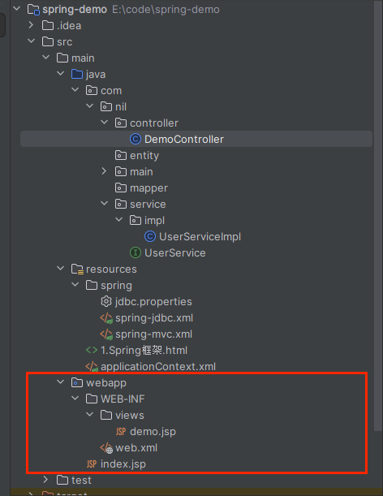
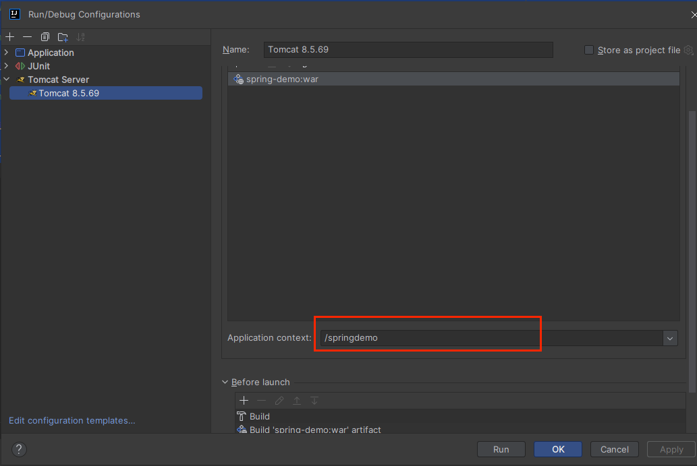
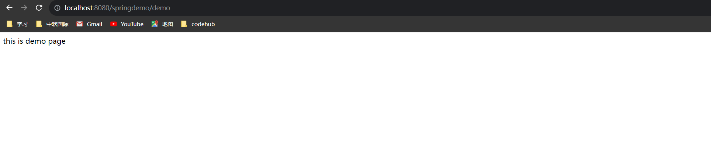
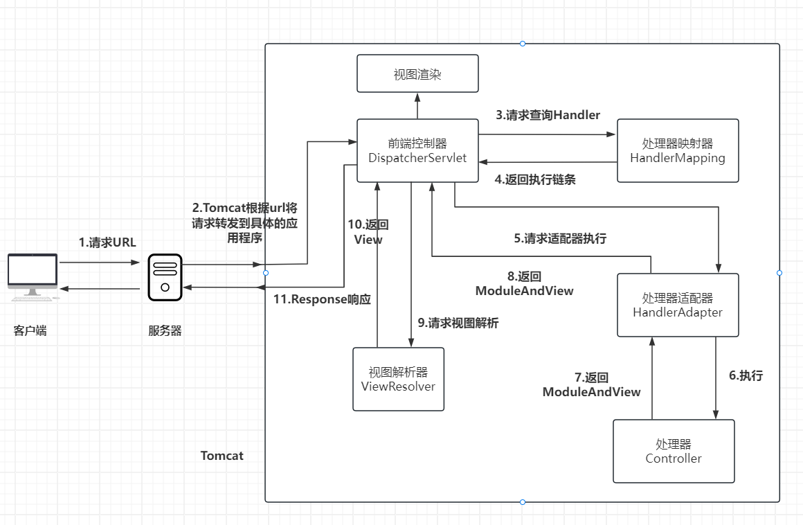

## 3 Spring MVC框架

#### 1 spring MVC框架简介

Spring MVC是一种基于Java实现的MVC设计模型请求驱动类型的轻量级web框架，属于spring framework的后续产品，已经融入spring web
flow中。

### 2 Spring MVC 快速搭建

#### 2.1 引入坐标

```xml

<project xmlns="http://maven.apache.org/POM/4.0.0" xmlns:xsi="http://www.w3.org/2001/XMLSchema-instance"
         xsi:schemaLocation="http://maven.apache.org/POM/4.0.0 http://maven.apache.org/maven-v4_0_0.xsd">
    <modelVersion>4.0.0</modelVersion>
    <groupId>com.nil</groupId>
    <artifactId>spring-demo</artifactId>
    <packaging>war</packaging>
    <version>1.0-SNAPSHOT</version>
    <name>spring-demo Maven Webapp</name>
    <url>http://maven.apache.org</url>
    <dependencies>
        <dependency>
            <groupId>org.springframework</groupId>
            <artifactId>spring-context</artifactId>
            <version>5.3.29</version>
        </dependency>

        <dependency>
            <groupId>org.springframework</groupId>
            <artifactId>spring-web</artifactId>
            <version>5.3.29</version>
        </dependency>
        <!--spring MVC 坐标-->
        <dependency>
            <groupId>org.springframework</groupId>
            <artifactId>spring-webmvc</artifactId>
            <version>5.3.29</version>
        </dependency>

        <dependency>
            <groupId>junit</groupId>
            <artifactId>junit</artifactId>
            <version>4.13.1</version>
            <scope>test</scope>
        </dependency>
    </dependencies>
    <build>
        <finalName>spring-demo</finalName>
        <plugins>
            <plugin>
                <groupId>org.apache.maven.plugins</groupId>
                <artifactId>maven-compiler-plugin</artifactId>
                <configuration>
                    <source>6</source>
                    <target>6</target>
                </configuration>
            </plugin>
        </plugins>
    </build>
</project>

```

#### 2.2 配置spring MVC核心DispathcerServlet，在web.xml中进行配置

```xml
<!DOCTYPE web-app PUBLIC
        "-//Sun Microsystems, Inc.//DTD Web Application 2.3//EN"
        "http://java.sun.com/dtd/web-app_2_3.dtd" >

<web-app>
    <display-name>Archetype Created Web Application</display-name>
    <servlet>
        <servlet-name>springMVC</servlet-name>
        <servlet-class>org.springframework.web.servlet.DispatcherServlet</servlet-class>
        <init-param>
            <param-name>contextConfigLocation</param-name>
            <param-value>classpath:applicationContext.xml</param-value>
        </init-param>
        <load-on-startup>1</load-on-startup>
    </servlet>
    <servlet-mapping>
        <servlet-name>springMVC</servlet-name>
        <url-pattern>/</url-pattern>
    </servlet-mapping>
</web-app>

```

#### 2.3 创建controller类中和视图页面

```java
package com.nil.controller;

import org.springframework.stereotype.Controller;
import org.springframework.web.bind.annotation.RequestMapping;

@Controller
public class DemoController {

    @RequestMapping("/demo")
    public String save() {
        System.out.println("==exec save===");
        return "/WEB-INF/views/demo.jsp";
    }
}

```



#### 2.4 使用注解配置Controller类中业务方法的映射地址

- http://localhost:8080/springdemo/demo



#### 2.5 配置spring MVC 核心文件spring-mvc.xml

```xml
<?xml version="1.0" encoding="UTF-8"?>
<beans xmlns="http://www.springframework.org/schema/beans"
       xmlns:mvc="http://www.springframework.org/schema/mvc"
       xmlns:context="http://www.springframework.org/schema/context"
       xmlns:xsi="http://www.w3.org/2001/XMLSchema-instance"
       xsi:schemaLocation="http://www.springframework.org/schema/beans http://www.springframework.org/schema/beans/spring-beans.xsd
       http://www.springframework.org/schema/mvc  http://www.springframework.org/schema/mvc/spring-mvc.xsd
       http://www.springframework.org/schema/context   http://www.springframework.org/schema/context/spring-context.xsd">
    <!--开启注解扫描-->
    <mvc:annotation-driven/>

    <context:component-scan base-package="com.nil.controller"/>
</beans>
```

#### 2.6 客户端发起请求测试



### 3 spring MVC的组件解析

#### 4.1 运行图



#### 4.2 运行过程

1、用户发起请求至前端控制器DispatcherServlet\
2、DispatcherServlet收到请求调用handler mapping处理器映射器\
3、处理器映射器查找具体的处理器（根据注解或xml配置），生处理器对象以及处理器拦截器，如果有则生成，一同返回给DispatcherServlet。\
4、DispatcherServlet调用处理器适配器handler adapter。\
5、handler adapter 通过适配调用具体的处理器（也叫后端控制器）。\
6、Controller执行完毕后返回ModelAndView。\
7、handler adapter将执行结果ModelAndView返回给DispatcherServlet。\
8、DispatcherServlet将ModelAndView传给视图解析器ViewReslover。\
9、ViewReslover解析后返回view给DispatcherServlet\
10、DispatcherServlet根据view渲染视图，将模型数据填充至视图。DispatcherServlet响应用户。

### 4 spring MVC注解解析

| 注解              | 说明                                                                                           | 范围   |
|:----------------|----------------------------------------------------------------------------------------------|------|
| @Controller     | 标注为该类是一个Spring MVC控制器                                                                        | 类    |
| @RequestMapping | 处理请求的URI映射                                                                                   | 类、方法 |
| @PathVariable   | 用于将URI中的模板变量绑定到方法的参数上                                                                        | 参数   |
| @RequestParam   | 用于将请求参数绑定到方法的参数上                                                                             | 参数   |
| @ResponseBody   | 将方法的返回值直接作为响应体返回给客户端                                                                         | 类、方法 |
| @RequestBody    | 将请求体的参数绑定到方法的参数上                                                                             | 参数   |
| @RequestHeader  | 使用@RequestHeader可以获取请求头信息，相当于web阶段学习的request.getHeader(name)，value：请求头的名称required：是否必须携带此请求头 | 参数   |
| @CookieValue    | 使用@CookieValue可以获得指定Cookie的值，value：Cookie的名称required：是否必须携带此Cookie                           | 参数   |

### 5 spring MVC配置文件解析

````xml
<?xml version="1.0"encoding="UTF-8"?>
<beans xmlns="http://www.springframework.org/schema/beans"
       xmlns:mvc="http://www.springframework.org/schema/mvc"
       xmlns:context="http://www.springframework.org/schema/context"
       xmlns:xsi="http://www.w3.org/2001/XMLSchema-instance"
       xsi:schemaLocation="http://www.springframework.org/schema/beans http://www.springframework.org/schema/beans/spring-beans.xsd
        http://www.springframework.org/schema/mvc  http://www.springframework.org/schema/mvc/spring-mvc.xsd
        http://www.springframework.org/schema/context   http://www.springframework.org/schema/context/spring-context.xsd">
    <!--开启注解扫描-->
    <mvc:annotation-driven/>

    <context:component-scan base-package="com.nil.controller"/>

    <bean class="org.springframework.web.servlet.view.InternalResourceViewResolver">
        <property name="prefix" value="/WEB-INF/views/"/>
        <property name="suffix" value=".jsp"/>
    </bean>
</beans>
````

### 6 spring MVC的数据响应方式

### 7 spring MVC获取请求数据

### 8 请求数据乱码问题

### 9 自定义类型转换器

### 10 获得请求头

### 11 文件上传