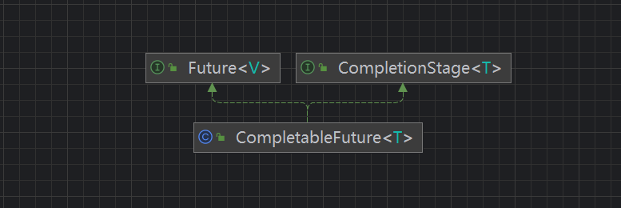

## CompletableFuture

对于简单的业务场景使用Future完全OK，但是对于复杂的业务场景，future的功能单一，不能支撑，性能也不够优异\
所以我们希望：

- 回调通知：\
  1、应对Future的完成时间，完成了可以告诉我，这也就是回调通知.\
  2、通过轮询的方式去判断任务是否完成，这样的方式会占CPU内存，也不优雅。
- 创建异步任务：Future + 线程池的配合
- 对于多个任务前依赖可以组合处理（水煮鱼）\
  1、想将多个异步任务的计算结果组合起来，后一个异步任务的计算结果需要前一个异步任务的值\
  2、将两个或者多个异步计算合并成一个异步计算，这几个异步计算相互独立，同时后面这个又依赖前一个处理的结果
- 对于计算速度最快
  使用Future之前提供的那些API就很单一，也不够优雅，这时候就需要CompletableFuture以声明式的方式来处理这些需求，Future能干的，我也能干，Future不能干的，我也能干。\
  Future阻塞的方式与异步编程的设计理念相违背，而轮询的方式又会消耗无谓的CPU资源，因此CompletableFuture再JDK1.8应运而生，因此CompletableFuture再JDK1提供了一种观察者模式类似的机制，可以让任务执行完后通知监听的一方。

### 1.CompletableFuture(JDK1.8) 继承关系图



### 2.CompletionStage interface

- CompletionStage代表异步计算的某一个阶段，一个阶段结束可能会触发另外一个阶段
- 一个阶段的执行可以是一个Function, Consumer, 或者Runnable接口
- 一个阶段的执行可能是被单个阶段的完成触发，也可能是多个阶段一起触发

### 3.CompletableFuture创建异步任务

没有指定Executor的方法，默认使用的是java.util.concurrent.ForkJoinPool.commonPool()
作为它的线程池执行异步代码，如果指定了线程池，则使用我们自定义或者特别指定别的线程池异步执行代码。

#### 3.1 runAsync 无返回值

```java

public class CompletableFuture<T> implements Future<T>, CompletionStage<T> {
    public static CompletableFuture<Void> runAsync(Runnable runnable) {
        return asyncRunStage(asyncPool, runnable);
    }

    public static CompletableFuture<Void> runAsync(Runnable runnable,
                                                   Executor executor) {
        return asyncRunStage(screenExecutor(executor), runnable);
    }
}
```

#### 3.2 supplyAsync 有返回值

```java
public class CompletableFuture<T> implements Future<T>, CompletionStage<T> {
    public static <U> CompletableFuture<U> supplyAsync(Supplier<U> supplier) {
        return asyncSupplyStage(asyncPool, supplier);
    }


    public static <U> CompletableFuture<U> supplyAsync(Supplier<U> supplier,
                                                       Executor executor) {
        return asyncSupplyStage(screenExecutor(executor), supplier);
    }

}
```

demo演示：

```java
package com.box.step8Juc;

import java.util.concurrent.*;

/**
 * @author tangsx
 * @createTime 2023/11/10 22:10
 * @description
 */
public class CompletableFutureDemo {
    public static void main(String[] args) throws ExecutionException, InterruptedException {
        ExecutorService threadPool = Executors.newFixedThreadPool(3);
        CompletableFuture<Void> future = CompletableFuture.runAsync(() -> {
            try {
                System.out.println(Thread.currentThread().getName());
                TimeUnit.SECONDS.sleep(5L);
            } catch (InterruptedException e) {
                throw new RuntimeException(e);
            }
        });
        System.out.println(future.get());
        System.out.println("线程结束");
        CompletableFuture<String> future1 = CompletableFuture.supplyAsync(() -> {
            try {
                System.out.println(Thread.currentThread().getName());
                TimeUnit.SECONDS.sleep(5L);
            } catch (InterruptedException e) {
                throw new RuntimeException(e);
            }
            return "test1";
        }, threadPool);
        System.out.println(future1.get());
        threadPool.shutdown();
    }
}

```

exec result:

```shell
ForkJoinPool.commonPool-worker-9
null
线程结束
pool-1-thread-1
test1
```

#### 3.3 如何减少阻塞和轮询

从Java8开始引入CompletableFuture，它是Future的功能增强版，减少阻塞和轮询，可以传入回调对象，当异步任务完成或发生异常时，自动调用回调对象的回调方法。

```java
import java.util.Objects;
import java.util.concurrent.CompletableFuture;
import java.util.concurrent.ExecutionException;
import java.util.concurrent.ThreadLocalRandom;
import java.util.concurrent.TimeUnit;

public class CompletableFutureUseDemo {

    public static void main(String[] args) throws ExecutionException, InterruptedException {
        diff();
    }

    /**
     * 完全可以替代Future
     *
     * @throws ExecutionException   ExecutionException
     * @throws InterruptedException InterruptedException
     */
    public static void sameFuture() throws ExecutionException, InterruptedException {
        CompletableFuture<Integer> future = CompletableFuture.supplyAsync(() -> {
            System.out.println(Thread.currentThread().getName() + "-------come in process");
            int result = ThreadLocalRandom.current().nextInt(10);
            try {
                TimeUnit.SECONDS.sleep(1L);
            } catch (InterruptedException e) {
                e.printStackTrace();
            }
            System.out.println("-------1s-------get result :" + result);
            return result;
        });
        System.out.println(Thread.currentThread().getName() + "线程先去忙其他任务");
        System.out.println(future.get());
    }

    public static void diff() {
        CompletableFuture<Integer> future = CompletableFuture.supplyAsync(() -> {
            System.out.println(Thread.currentThread().getName() + "-------come in process");
            int result = ThreadLocalRandom.current().nextInt(10);
            try {
                TimeUnit.SECONDS.sleep(1L);
            } catch (InterruptedException e) {
                throw new RuntimeException();
            }
            System.out.println("-------1s-------get result :" + result);
            return result;
        }).whenComplete((v, e) -> {
            if (Objects.isNull(e)) {
                System.out.println("=====计算完成，更新系统" + v);
            }
        }).exceptionally(e -> {
            e.printStackTrace();
            System.out.println("系统发生故障，请稍后再试");
            return null;
        });
        System.out.println(Thread.currentThread().getName() + "线程先去忙其他任务");
    }
}
```

主线程不要立马结束，否则CompletableFuture使用的默认线程池会立刻关闭

```shell
ForkJoinPool.commonPool-worker-9-------come in process
main线程先去忙其他任务
```

改进：

```java
package com.box.step8Juc;

import java.util.Objects;
import java.util.concurrent.*;

/**
 * @author tangsx
 * @createTime 2023/11/11 0:40
 * @description
 */
public class CompletableFutureUseDemo {

    public static void main(String[] args) throws ExecutionException, InterruptedException {
        diff();
    }

    /**
     * 完全可以替代Future
     *
     * @throws ExecutionException   ExecutionException
     * @throws InterruptedException InterruptedException
     */
    public static void sameFuture() throws ExecutionException, InterruptedException {
        CompletableFuture<Integer> future = CompletableFuture.supplyAsync(() -> {
            System.out.println(Thread.currentThread().getName() + "-------come in process");
            int result = ThreadLocalRandom.current().nextInt(10);
            try {
                TimeUnit.SECONDS.sleep(1L);
            } catch (InterruptedException e) {
                e.printStackTrace();
            }
            System.out.println("-------1s-------get result :" + result);
            return result;
        });
        System.out.println(Thread.currentThread().getName() + "线程先去忙其他任务");
        System.out.println(future.get());
    }

    public static void diff() {
        ExecutorService threadPool = Executors.newFixedThreadPool(3);
        try {
            CompletableFuture<Integer> future = CompletableFuture.supplyAsync(() -> {
                System.out.println(Thread.currentThread().getName() + "-------come in process");
                int result = ThreadLocalRandom.current().nextInt(10);
                try {
                    TimeUnit.SECONDS.sleep(1L);
                } catch (InterruptedException e) {
                    throw new RuntimeException();
                }
                // System.out.println(1/0); 造异常
                System.out.println("-------1s-------get result :" + result);
                return result;
            }, threadPool).whenComplete((v, e) -> {
                if (Objects.isNull(e)) {
                    System.out.println("=====计算完成更新系统" + v);
                }
            }).exceptionally(e -> {
                e.printStackTrace();
                System.out.println("系统发生故障，请稍后再试");
                return null;
            });
            System.out.println(Thread.currentThread().getName() + "线程先去忙其他任务");
        } catch (Exception e) {
            e.printStackTrace();
        } finally {
            threadPool.shutdown();
        }
        // TimeUnit.SECONDS.sleep(3L);
    }
}

```

执行结果：

```shell
pool-1-thread-1-------come in process
main线程先去忙其他任务
-------1s-------get result :7
=====计算完成更新系统7
```

### 4.CompletableFuture优点

- 1、异步任务结束时，会调用某个对象的方法
- 2、主线程设置好回调后，不在关心异步任务的执行，异步任务之间可以顺序执行
- 3、异步任务出错时，会自动回调某个对象的方法