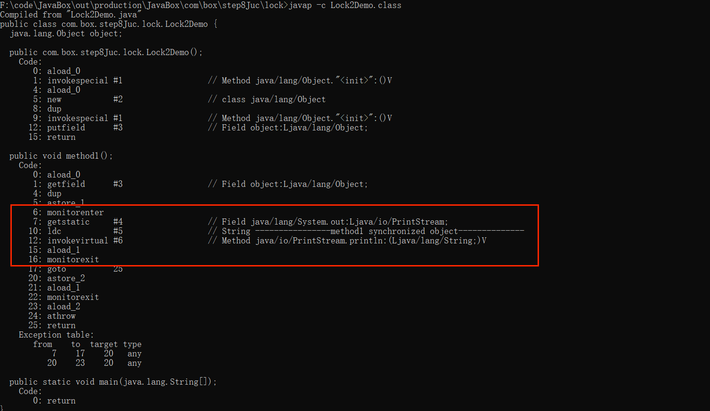

## Java 锁

### 0.synchronized

反编译指令：javap -c ****.class\
-c 对代码进行反汇编\
-v 输出更多的附加信息（行号、本地变量表、反汇编等详细信息）\

- 代码块
  monitorenter获得锁\
  monitorexit释放锁
  
  编译多了一个monitorexit释放锁，是因为需要在抛出异常时释放锁
  
  一般情况下是一个enter配合两exit\
  特殊情况：
  

- 同步成员方法
  调用指令将会检查方法的ACC_SYNCHRONIZED访问标志是否被设置。如果设置了，执行线程就先持有monitor锁，然后再执行方法，最后在方法完成时（无论是正常完成还是非正常完成）释放monitor
  
- 同步静态方法
  

- ACC_SYNCHRONIZED：\
  方法级的同步是隐式的，无需通过字节码指令来控制，它实现再方法调用和返回操作之中，虚拟机可以从方法常量池中的方法表结构中的ACC_SYNCHRONIZED来确定方法是否被声明为同步方法。
  当方法被调用时，调用指令会检查方法的ACC_SYNCHRONIZED访问标志是否被设置，如果设置了，要求执行线程要先持有管程，然后才能执行方法，最后当方法完成时释放管程。在方法执行期间
  ，执行线程持有了管程，其他任何线程都无法再获取

### 1.乐观锁和悲观锁

高并发时，同步调用应该去考量锁的性能损耗，能使用无锁数据结构，就不要使用锁；能锁区块，就不要锁整个方法体；能用对象锁，就不要使用类锁。\
说明：尽可能使加锁的代码块工作量尽可能的小，避免在锁代码块中调用RPC方法。

#### 1.1 乐观锁

认为自己再使用数的时候不会有别的线程修改数据或资源，所以不添加锁\
在Java中是通过无锁编程来实现的，只是在更新数据的时候去判断，之前有没有别的线程更新了这个数据。\
如果这个数据没有被更新，那么当前线程将自己修改的数据成功写入。\
如果这个数据已经被其他线程更新，那么根据不同的实现执行不同的操作，比如说放弃修改、重试抢锁等等。

判断规则：

- 版本号机制version
- 最常采用的是CAS算法，Java原子类的操作就是通过CAS自旋锁实现的。
  应用场景：适合读操作多的场景，不加锁的特点能够使其读操作的性能大幅度提升。乐观锁则直接去操作同步资源，是一种无锁算法

#### 1.2 悲观锁

认为自己在使用数据的时候一定有别的线程来修改数据，因此在获取数据的时会加锁，确保数据不会被别的线程修改\
synchronized和Lock的实现类都是悲观锁\
应用场景：适合写操作比较多的场景，先加锁可以保证写操作时数据正确
显示的锁定之后再操作同步资源

### 2.公平锁和非公平锁

#### 2.1 公平锁

是指多个线程按照申请锁的顺序来获取锁，似排队买票，获取资源的几率是一致的

ReentrantLock lock = new ReentrantLock(true);// 表示公平锁 先来先得

#### 2.2 非公平锁

是指多个线程按照获取锁的顺序不是按照申请锁的顺序，有可能后申请的线程比先申请的线程优先获取锁，在高并发的情况下。有可能造成优先级翻转或者饥饿的状态

ReentrantLock lock = new ReentrantLock(false);// 表示非公平锁 后来的可能先获得锁
ReentrantLock lock = new ReentrantLock(); // 默认非公平锁

#### 2.3 为什么会有公平锁和非公平锁的设计，为什么默认不公平/什么时候用公平？什么时候用非公平？

1、恢复挂起的线程到真正锁的获取还是有时间差的，从开发人员来讲，这个时间是微乎其微的，但是从CPU的角度来看，这个时间差的存在还是很明显的。所以非公平锁能更充分的利用时间片，尽量减少CPU的空闲状态时间。\
2、使用多线程很重要的是考虑线程切换的开销，使用非公平锁的时候，当一个线程请求获取锁同步状态，然后释放同步状态，所以杠释放锁的线程再次获取同步状态的概率就会非常大，所以就减少了线程的开销。

### 3.可重入锁（递归锁）

**可重入锁**指的是可重复可递归调用的锁，在外层使用锁之后，在内层仍然可以使用，并且不发生死锁，这样的锁就叫做可重入锁\
简单的来讲就是：在一个synchronized修饰的方法或代码块的内部调用本类的其他synchronized修饰的方法或代码块时，是永远可以得到锁的

可以再次进入同步锁\
进入的目标指的是同步域：同步代码块/方法或显示锁定\
一个线程中的多个流程可以获取同一把锁，持有这把同步锁可以再次进入。自己可以获取自己内部的锁\
是指在同一个线程外层获取锁的时候，在进入该线程内层方法会自动获取锁（前提是，锁对象得是同一个对象），不会因为之前已经获取过还没释放而阻塞。

如果是一个synchronized修饰的递归调用方法，程序第二次进入被自己阻塞了岂不是天大的笑话，作茧自缚\
所以在Java中synchronized和ReentrantLock都是可重入锁，可重入锁的出现一定程度上避免了死锁

#### 3.1 隐式锁（即synchronized）关键字使用的锁 默认是可重入锁

```java
package com.box.step8Juc.lock;

public class Lock3Demo {

    public static void main(String[] args) {
        final Object object = new Object();
        reEntryM1(object);

        Lock3Demo demo = new Lock3Demo();

        new Thread(demo::m1, "t1").start();
    }

    public static void reEntryM1(Object object) {
        new Thread(() -> {
            synchronized (object) {
                System.out.println(Thread.currentThread().getName() + "\t-------外层调用");
                synchronized (object) {
                    System.out.println(Thread.currentThread().getName() + "\t-------中层调用");
                    synchronized (object) {
                        System.out.println(Thread.currentThread().getName() + "\t-------内层调用");
                    }
                }
            }
        }, "t1").start();
    }

    public synchronized void m1() {
        System.out.println("exec  M1");
        synchronized (this) {
            System.out.println(Thread.currentThread().getName() + "exec code block");
        }
        this.m2();
    }

    public synchronized void m2() {
        System.out.println("exec  M2");
        this.m3();
    }

    public synchronized void m3() {
        System.out.println("exec  M3");
    }

}

```

#### 3.2 synchronized的重入实现原理

- 1、每个锁对象拥有一个锁计数器和一个指向持有该锁的线程的指针。
- 2、当执行monitorenter时，如果目标对象的计数器为0，那么说明它没有被其他线程所持有，Java虚拟机会将该锁对象的持有线程设置为当前线程，并且将计数器加1。
- 3、在目标锁对象的计数器不为0时，如果锁对象持有线程是当前线程，那么Java虚拟机可以将其计数器加1，否则需要等待，直至持有线程释放该锁。
- 4、当执行monitorexit时，Java虚拟机则需将对象的计数器减1.计数器为0代表锁已被释放。

#### 3.3 显式锁(即lock)，也有ReentrantLock这样的重入锁

一般来讲，可重入锁加锁几次就得释放几次，如果加锁此时和释放锁的次数不一致，那么会导致下一个线程一直在等待，甚至会出现死锁。

```java
package com.box.step8Juc.lock;

import java.util.concurrent.locks.ReentrantLock;

/**
 * @author tangsx
 * @createTime 2023/11/12 22:17
 * @description
 */
public class Lock4Demo {

    static ReentrantLock lock = new ReentrantLock();

    public static void main(String[] args) {
        new Thread(() -> {
            lock.lock();
            try {
                System.out.println(Thread.currentThread().getName() + "\t exec 外层");
                lock.lock();
                try {
                    lock.lock();
                    try {
                        System.out.println(Thread.currentThread().getName() + "\t exec 中层");
                        lock.lock();
                        try {
                            System.out.println(Thread.currentThread().getName() + "\t exec 外层");
                        } finally {
                            lock.unlock();
                        }
                    } finally {
                        lock.unlock();
                    }
                } finally {
                    lock.unlock();
                }
            } finally {
//                lock.unlock();
            }
        }, "t1").start();

        new Thread(() -> {
            lock.lock();
            try {
                System.out.println("===============");
            } finally {
                lock.unlock();
            }
        }, "t2").start();

    }
}

```

### 4.死锁及排查

死锁是指两个及以上的线程在执行过程中，因争夺资源而造成一种相互等待的现象，若无外力干涉那么他们都将无法推进进去，如果系统资源充足，进程的资源都能得到满足，
死锁出现的可能性就会更低，否则就会因为争夺有限的资源而陷入死锁。


#### 4.1 死锁CASE

```java
package com.box.step8Juc.lock;

/**
 * @author tangsx
 * @createTime 2023/11/12 22:38
 * @description
 */
public class Lock5Demo {
    public static void main(String[] args) {
        final Object obj1 = new Object();
        final Object obj2 = new Object();
        new Thread(() -> {
            synchronized (obj1) {
                System.out.println(Thread.currentThread().getName() + "持有锁obj1 尝试获取锁obj2");
                try {
                    Thread.sleep(1000L);
                } catch (InterruptedException e) {
                    throw new RuntimeException(e);
                }
                synchronized (obj2) {
                    System.out.println("持有obj2");
                }
            }
        }, "t1").start();

        new Thread(() -> {
            synchronized (obj2) {
                System.out.println(Thread.currentThread().getName() + "持有锁obj2 尝试获取锁obj1");
                synchronized (obj1) {
                    System.out.println("持有obj1");
                }
            }
        }, "t2").start();
    }
}

```

#### 4.2 排查死锁

- 1 jpsl 2 jstack 进程号
  如图所示：
  
  查看结果
  

- 2 还可以使用jconsle
  

### 5.写锁(独占锁)/读锁(共享锁)

### 6.自旋锁spinLock

### 7、无锁->独占锁->读写锁->邮戳锁

### 8、无锁->偏向锁->清量锁->重量锁
