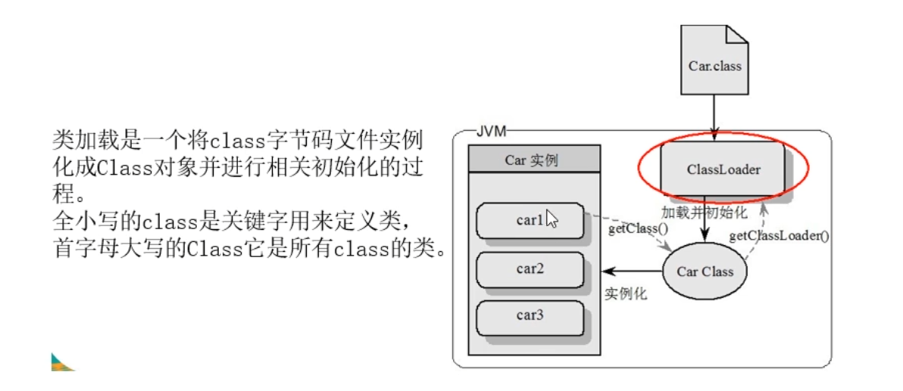

## 6-1.Java锁案例说明

线程操作资源类

### 1.标准访问，t1 t2 线程分别调用sendEmail和sendSms方法（此时方法均为成员方法）

```java
package com.box.step8Juc.lock;

import java.util.concurrent.TimeUnit;

/**
 * @author tangsx
 * @createTime 2023/11/12 14:07
 * @description
 */
public class Lock1Demo {

    /**
     * 程序入口
     *
     * @param args
     */
    public static void main(String[] args) {
        Phone phone = new Phone();
        // 发邮件
        new Thread(() -> {
            phone.sendEmail();
        }, "t1").start();

        // 保障t1先启动
        try {
            TimeUnit.MILLISECONDS.sleep(200L);
        } catch (Exception e) {
            throw new RuntimeException();
        }

        // 发短信
        new Thread(() -> {
            phone.sendSms();
        }, "t2").start();
    }
}

/**
 * 资源类
 */
class Phone {

    public synchronized void sendEmail() {
        System.out.println("===========sendEmail===========");
    }

    public synchronized void sendSms() {
        System.out.println("===========sendSms=============");
    }

    public void hello() {
        System.out.println("hello");
    }
}
```

exec result：

```shell
===========sendEmail===========
===========sendSms=============
```

### 2.sendEmail中假如休眠3s，请问先打印sendEmail还是sendSms

```java
package com.box.step8Juc.lock;

import java.util.concurrent.TimeUnit;

/**
 * @author tangsx
 * @createTime 2023/11/12 14:07
 * @description
 */
public class Lock1Demo {

    /**
     * 程序入口
     *
     * @param args
     */
    public static void main(String[] args) {
        Phone phone = new Phone();
        // 发邮件
        new Thread(() -> {
            phone.sendEmail();
        }, "t1").start();

        // t1 先启动
        try {
            TimeUnit.MILLISECONDS.sleep(200L);
        } catch (Exception e) {
            throw new RuntimeException();
        }

        // 发短信
        new Thread(() -> {
            phone.sendSms();
        }, "t2").start();
    }
}

/**
 * 资源类
 */
class Phone {

    public synchronized void sendEmail() {
        try {
            TimeUnit.MILLISECONDS.sleep(3000L);
        } catch (InterruptedException e) {
            throw new RuntimeException(e);
        }
        System.out.println("===========sendEmail===========");
    }

    public synchronized void sendSms() {
        System.out.println("===========sendSms=============");
    }

    public void hello() {
        System.out.println("hello");
    }
}
```

exec result：

```shell
===========sendEmail===========
===========sendSms=============
```

总结：一个对象里面如果有多个synchronized方法，在某一时刻内，只要有一个线程去调用其中的一个synchronized方法，其他线程只能等待，换句话说，某一个时刻内，只能有唯一的一个线程去访问synchronized
方法，锁的是当前对象this，被锁定后，其他的线程都不能进入当前对象的其他synchronized方法。

### 3.添加一个普通的hello方法，请问先打印邮件还是hello

```java
package com.box.step8Juc.lock;

import java.util.concurrent.TimeUnit;

/**
 * @author tangsx
 * @createTime 2023/11/12 14:07
 * @description
 */
public class Lock1Demo {

    /**
     * 程序入口
     *
     * @param args
     */
    public static void main(String[] args) {
        Phone phone = new Phone();
        // 发邮件
        new Thread(() -> {
            phone.sendEmail();
        }, "t1").start();

        // t1 先启动
        try {
            TimeUnit.MILLISECONDS.sleep(200L);
        } catch (Exception e) {
            throw new RuntimeException();
        }

        // 发短信
        new Thread(() -> {
            phone.hello();
        }, "t2").start();
    }
}

/**
 * 资源类
 */
class Phone {

    public synchronized void sendEmail() {
        try {
            TimeUnit.MILLISECONDS.sleep(3000L);
        } catch (InterruptedException e) {
            throw new RuntimeException(e);
        }
        System.out.println("===========sendEmail===========");
    }

    public synchronized void sendSms() {
        System.out.println("===========sendSms=============");
    }

    public void hello() {
        System.out.println("hello");
    }
}
```

exec result：

```shell
hello
===========sendEmail===========
```

总结：因为非同步成员方法不需要获得对象的锁，只有当其他线程尝试访问同步成员方法时，他们才会被阻塞，因为它们需要获得对象锁

### 4.有两个实例，请问先打印sendEmail还是sendSms

```java
package com.box.step8Juc.lock;

import java.util.concurrent.TimeUnit;

/**
 * @author tangsx
 * @createTime 2023/11/12 14:07
 * @description
 */
public class Lock1Demo {

    /**
     * 程序入口
     *
     * @param args
     */
    public static void main(String[] args) {
        Phone phone1 = new Phone();
        Phone phone2 = new Phone();
        // 发邮件
        new Thread(() -> {
            phone1.sendEmail();
        }, "t1").start();

        // t1 先启动
        try {
            TimeUnit.MILLISECONDS.sleep(200L);
        } catch (Exception e) {
            throw new RuntimeException();
        }

        // 发短信
        new Thread(() -> {
            phone2.sendSms();
        }, "t2").start();
    }
}

/**
 * 资源类
 */
class Phone {

    public synchronized void sendEmail() {
        try {
            TimeUnit.MILLISECONDS.sleep(3000L);
        } catch (InterruptedException e) {
            throw new RuntimeException(e);
        }
        System.out.println("===========sendEmail===========");
    }

    public synchronized void sendSms() {
        System.out.println("===========sendSms=============");
    }

    public void hello() {
        System.out.println("hello");
    }
}
```

exec result：

```shell
===========sendSms=============
===========sendEmail===========
```

总结：两个不一样的对象，获取到的锁是不一样的，所以并不互相影响。

### 5.sendEmail和sendSms均为静态同步方法，有一个实例，请问先打印邮件还是短信

```java
package com.box.step8Juc.lock;

import java.util.concurrent.TimeUnit;

/**
 * @author tangsx
 * @createTime 2023/11/12 14:07
 * @description
 */
public class Lock1Demo {

    /**
     * 程序入口
     *
     * @param args
     */
    public static void main(String[] args) {
        Phone phone1 = new Phone();
//        Phone phone2 = new Phone();
        // 发邮件
        new Thread(() -> {
            phone1.sendEmail();
        }, "t1").start();

        // t1 先启动
        try {
            TimeUnit.MILLISECONDS.sleep(200L);
        } catch (Exception e) {
            throw new RuntimeException();
        }

        // 发短信
        new Thread(() -> {
            phone1.sendSms();
        }, "t2").start();
    }
}

/**
 * 资源类
 */
class Phone {

    public static synchronized void sendEmail() {
        try {
            TimeUnit.MILLISECONDS.sleep(3000L);
        } catch (InterruptedException e) {
            throw new RuntimeException(e);
        }
        System.out.println("===========sendEmail===========");
    }

    public static synchronized void sendSms() {
        System.out.println("===========sendSms=============");
    }

    public void hello() {
        System.out.println("hello");
    }
}
```

exec result：

```shell
===========sendEmail===========
===========sendSms=============
```

### 6.sendEmail和sendSms均为静态同步方法，有2个实例，请问先打印邮件还是短信

```java
package com.box.step8Juc.lock;

import java.util.concurrent.TimeUnit;

/**
 * @author tangsx
 * @createTime 2023/11/12 14:07
 * @description
 */
public class Lock1Demo {

    /**
     * 程序入口
     *
     * @param args
     */
    public static void main(String[] args) {
        Phone phone1 = new Phone();
        Phone phone2 = new Phone();
        // 发邮件
        new Thread(() -> {
            phone1.sendEmail();
        }, "t1").start();

        // t1 先启动
        try {
            TimeUnit.MILLISECONDS.sleep(200L);
        } catch (Exception e) {
            throw new RuntimeException();
        }

        // 发短信
        new Thread(() -> {
            phone2.sendSms();
        }, "t2").start();
    }
}

/**
 * 资源类
 */
class Phone {

    public static synchronized void sendEmail() {
        try {
            TimeUnit.MILLISECONDS.sleep(3000L);
        } catch (InterruptedException e) {
            throw new RuntimeException(e);
        }
        System.out.println("===========sendEmail===========");
    }

    public static synchronized void sendSms() {
        System.out.println("===========sendSms=============");
    }

    public void hello() {
        System.out.println("hello");
    }
}
```

exec result：

```shell
===========sendEmail===========
===========sendSms=============
```

总结：静态同步方法锁的是类锁，不管是phone1还是phone2，来自的类模板是一致的，所以先获取到类锁的先执行，后获取到的后执行\
对于普通成员方法，锁的是当前实例对象，通常指的是this，具体就比如指的是同一部手机，所有同步方法用的是同一把锁->实例对象本身\
对于静态同步方法，锁的是当前Class类的class对象，如Phone.class的唯一模板\
对于同步代码块，锁的是synchronized括号内的对象\

### 7、有一个静态同步方法，有一个普通同步方法，有1部手机 请问先打印邮件还是短信

```java
package com.box.step8Juc.lock;

import java.util.concurrent.TimeUnit;

/**
 * @author tangsx
 * @createTime 2023/11/12 14:07
 * @description
 */
public class Lock1Demo {

    /**
     * 程序入口
     *
     * @param args
     */
    public static void main(String[] args) {
        Phone phone1 = new Phone();
//        Phone phone2 = new Phone();
        // 发邮件
        new Thread(() -> {
            phone1.sendEmail();
        }, "t1").start();

        // t1 先启动
        try {
            TimeUnit.MILLISECONDS.sleep(200L);
        } catch (Exception e) {
            throw new RuntimeException();
        }

        // 发短信
        new Thread(() -> {
            phone1.sendSms();
        }, "t2").start();
    }
}

/**
 * 资源类
 */
class Phone {

    public static synchronized void sendEmail() {
        try {
            TimeUnit.MILLISECONDS.sleep(3000L);
        } catch (InterruptedException e) {
            throw new RuntimeException(e);
        }
        System.out.println("===========sendEmail===========");
    }

    public synchronized void sendSms() {
        System.out.println("===========sendSms=============");
    }

    public void hello() {
        System.out.println("hello");
    }
}
```

exec result：

```shell
===========sendSms=============
===========sendEmail===========
```

### 8、有一个静态同步方法，有一个普通同步方法，有2部手机 请问先打印邮件还是短信

```java
package com.box.step8Juc.lock;

import java.util.concurrent.TimeUnit;

/**
 * @author tangsx
 * @createTime 2023/11/12 14:07
 * @description
 */
public class Lock1Demo {

    /**
     * 程序入口
     *
     * @param args
     */
    public static void main(String[] args) {
        Phone phone1 = new Phone();
        Phone phone2 = new Phone();
        // 发邮件
        new Thread(() -> {
            phone1.sendEmail();
        }, "t1").start();

        // t1 先启动
        try {
            TimeUnit.MILLISECONDS.sleep(200L);
        } catch (Exception e) {
            throw new RuntimeException();
        }

        // 发短信
        new Thread(() -> {
            phone2.sendSms();
        }, "t2").start();
    }
}

/**
 * 资源类
 */
class Phone {

    public static synchronized void sendEmail() {
        try {
            TimeUnit.MILLISECONDS.sleep(3000L);
        } catch (InterruptedException e) {
            throw new RuntimeException(e);
        }
        System.out.println("===========sendEmail===========");
    }

    public synchronized void sendSms() {
        System.out.println("===========sendSms=============");
    }

    public void hello() {
        System.out.println("hello");
    }
}
```

exec result：

```shell
===========sendSms=============
===========sendEmail===========
```

总结：锁的对象不一样，一个是实例对象，一个是Class对象


