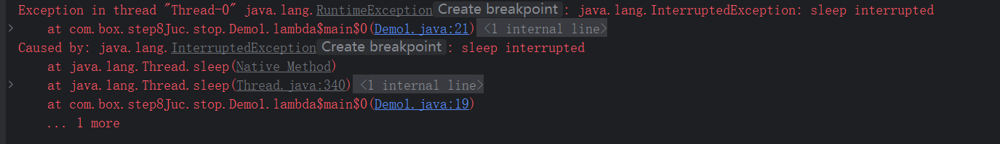
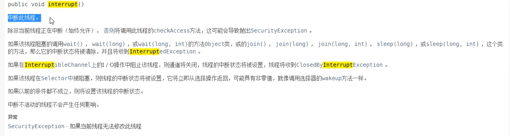

## 7.LockSupport与线程中断

### 1.中断机制之中断协商机制简介

首先一个线程不应该由其他线程来强制中断或停止，而是应该由线程自己自行停止，自己来决定自己的命运。\
所以Thread.stop()、Thread.suspend()、Thread.resume() 都已经被废弃了

其次在Java中没有办法立即停止一条线程，然而停止线程却显得尤为重要，如取消一个耗时操作。\
因此，Java提供了一种用于停止线程的协商机制--中断，也即中断协商机制。

中断只是一种协商机制，Java没有给中断增加任何语法，中断的过程完全需要程序员自身来实现。\
若要中断一个线程，你需要手动的调用该线程的interrupt()方法，该方法也仅仅是将线程对象的中断标识设为true；\
接着你需要自己写代码不断的检测当前线程的标识位，如果为true，标识别的线程请求这条线程中断\

每个线程对象中都会有一个中断标识位，用于表示线程是否被中断；该标识位为true表示中断，为false表示未中断；\
通过调用线程对象的interrupt方法将该线程的标识符设为true；可以在别的线程中调用，也可以在自己的线程中调用

### 2.中断机制之3大中断方法说明

- public void interrupt()
  实例方法，仅用来设置中断标志\
  实例方法interrupt()仅用来设置线程中的中断状态为true，发起一个协商而不会立刻停止线程

- public static boolean interrupted()
  静态方法\
  判断线程是否被中断并清除当前中断状态\
  干了两件事：\
  1、返回当前线程的中断状态，测试当前线程是否已经被中断\
  2、将当前线程的中断状态清零并重新设为false，清除线程的中断状态\
  如果连续两次调用此方法，则第二次调用可能会返回false，因为连续调用两侧的结果可能不一样

- public boolean isInterrupted()
  实例方法
  判断当前线程是否被中断（通过检查中断标志位）

### 3.中断机制实现

```java
package com.box.step8Juc.stop;

import java.util.concurrent.TimeUnit;
import java.util.concurrent.atomic.AtomicBoolean;

/**
 * @author tangsx
 * @createTime 2023/11/14 21:36
 * @description
 */
public class Demo1 {

    static volatile boolean isStop = false;
    static AtomicBoolean isSetStop = new AtomicBoolean(false);

    public static void main(String[] args) throws InterruptedException {
        autoVolatile();
        autoAtomicBoolean();
        autoByApi();
    }

    /**
     * volatile实现线程中断
     */
    public static void autoVolatile() {
        Thread t1 = new Thread(() -> {
            while (true) {
                if (isStop) {
                    System.out.println(Thread.currentThread().getName() + "\t isStop 被修改为true.程序停止");
                    break;
                }
                System.out.println("t1 hello volatile");
            }
        }, "t1");
        t1.start();
        try {
            TimeUnit.SECONDS.sleep(20L);
        } catch (InterruptedException e) {
            throw new RuntimeException(e);
        }

        Thread t2 = new Thread(() -> isStop = true, "t2");
        t2.start();
    }

    /**
     * AtomicBoolean实现线程中断
     */
    public static void autoAtomicBoolean() {
        Thread t1 = new Thread(() -> {
            while (true) {
                if (isSetStop.get()) {
                    System.out.println(Thread.currentThread().getName() + "\t isStop 被修改为true.程序停止");
                    break;
                }
                System.out.println("t1 hello volatile");
            }
        }, "t1");
        t1.start();
        try {
            TimeUnit.SECONDS.sleep(20L);
        } catch (InterruptedException e) {
            throw new RuntimeException(e);
        }

        Thread t2 = new Thread(() -> isSetStop.set(true), "t2");
        t2.start();
    }


    /**
     * interrupt isInterrupted中断线程
     */
    public static void autoByApi() {
        Thread t1 = new Thread(() -> {
            while (true) {
                if (Thread.currentThread().isInterrupted()) {
                    System.out.println(Thread.currentThread().getName() + "\t isStop 被修改为true.程序停止");
                    break;
                }
                System.out.println("t1 hello volatile");
            }
        }, "t1");
        t1.start();
        try {
            TimeUnit.SECONDS.sleep(20L);
        } catch (InterruptedException e) {
            throw new RuntimeException(e);
        }

        Thread t2 = new Thread(t1::interrupt, "t2");
        t2.start();
    }
}

```

### 4.isInterrupted()和interrupt()源码实现

1、如果线程状态处于正常活动状态，那么会将该线程的中断标志设置为true，仅此而已。\
被色湖之中断标志的线程将继续运行，不受影响。\
所以interrupt并不能真正的中断线程，需要被调用的线程自己配合才行

2、如果线程处于阻塞状态(sleep、wait、join等状态)，再别的线程调用当前对象的interrupt方法，\
那么线程将立即被退出，并且抛出一个java.lang.InterruptedException: sleep interrupted



#### 4.1 interrupt()源码



```java
class Thread implements Runnable {

    public void interrupt() {
        if (this != Thread.currentThread())
            checkAccess();

        synchronized (blockerLock) {
            Interruptible b = blocker;
            if (b != null) {
                interrupt0();           // Just to set the interrupt flag
                b.interrupt(this);
                return;
            }
        }
        interrupt0();
    }

    private native void interrupt0();
}
```

#### 4.2 isInterrupted()源码

```java
class Thread implements Runnable {

    public boolean isInterrupted() {
        return isInterrupted(false);
    }

    private native boolean isInterrupted(boolean ClearInterrupted);
}
```