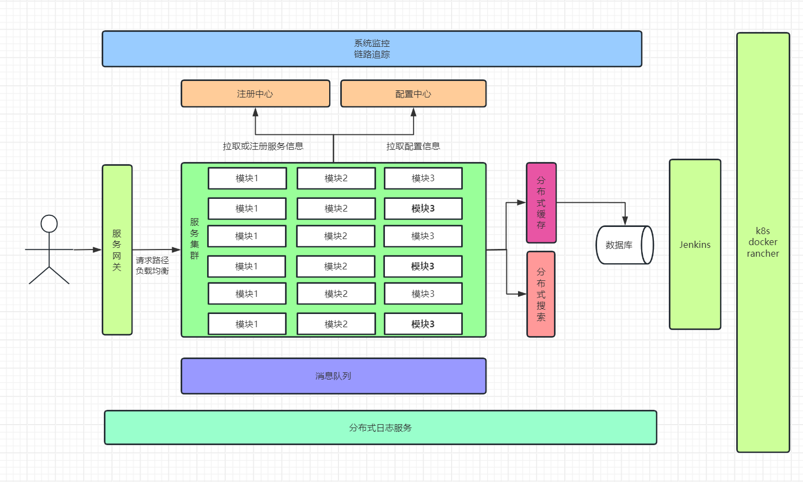

## 微服务

微服务!=spring cloud
微服务->服务拆分

### 1、微服务技术栈

#### 1.1、微服务治理

- 注册发现
- 远程调用
- 负载均衡
- 配置管理
- 网关路由
- 系统保护
- 流量控制
- 服务授权
- 熔断降级
- 分布式事务
- TCC模型
- AT模型
- Seata

#### 1.2、缓存技术

- 缓存穿透、雪崩、击穿
- Spring Data Redis
- Redis 主从复制
- OpenResty
- 缓存数据同步
- Nginx本地缓存
- Redis持久化
- 多级缓存分层
- Redis分片集群
- Lua脚本
- Redis数据结构

#### 1.3、异步通信技术

- MQ消息模型
- 消息堆积问题
- Spring AMQP
- 消息可靠性
- 仲裁队列
- 延迟队列
- 镜像集群
- 数据持久化

#### 1.4、搜索技术

- DSL语句
- ES集群
- RestAPI
- 集群脑裂
- 竞价排名
- 聚合统计
- 自动补全
- 地理坐标
- 拼音分词

#### 1.5、DevOps

- Docker file
- Docker compose
- GrayLog
- Jenkins
- Sky Walking
- Docker 使用
- Kubernates