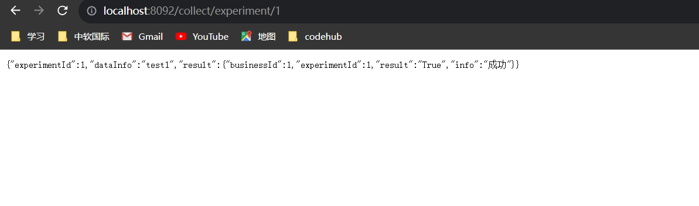

## 微服务

### 1、单体架构

将业务的所有功能集中在一个项目中开发，打成一个包部署。
优点：

- 架构简单
- 部署成本低

缺点：

- 耦合性高。

### 2、分布式架构

根据业务功能对系统进行拆分，每个业务模块作为独立项目开发，称为一个服务。

优点：

- 降低服务耦合
- 有利于服务的升级拓展

缺点：

- 架构复杂
- 难度大

需要考虑的问题？

- 服务粒度怎么划分？
- 集群地址如何维护？
- 如何实现远程调用？
- 服务健康状态如何感知？

### 3、微服务

微服务是一种经过良好架构设计的分布式方案，特征：

- 单一职责：微服务拆分粒度更小，每一个服务对应唯一的业务能力，做到单一职责，避免业务重复开发
- 面向服务：微服务对外暴露业务接口（RPC）
- 自治：团队独立、技术独立、数据独立、部署独立
- 隔离性强：服务调用做好隔离、容错、降级、避免出现级联问题

目的：高内聚、低耦合

缺点：

- 架构极其复杂
- 运维、监控、部署的难度在提高

### 4、微服务技术对比

| 基本类型    | Dubbo           | Spring cloud               | Spring cloud Alibaba       |
|:--------|-----------------|----------------------------|----------------------------|
| 注册中心    | zookeeper、redis | eureka、Consul              | Nacos、Eureka               |
| 服务远程调用  | Dubbo协议         | Feign（http协议）              | Dubbo、Feign                |
| 配置中心    | 无               | Spring cloud config        | Spring cloud config 、Nacos |
| 服务网关    | 无               | Spring cloud  Gateway、Zuul | Spring cloud  Gateway、Zuul |
| 服务监控与保护 | Dubbo-admin，功能弱 | Hystrix                    | sentinel                   |

### 5、服务拆分

服务拆分注意事项：

- 不同的服务，不要重复的开发相同的业务
- 微服务数据独立，不要访问其他微服务的数据库
- 微服务可以将自己的业务暴露为接口，供其他微服务调用

1、服务拆分需要根据业务模块拆分，做到单一职责，不要重复开发相同的业务\
2、微服务可以将业务暴露为接口，供其他微服务使用\
3、不同微服务都应该有自己独立的数据库

### 6、微服务远程调用

#### 6.1 微服务的调用方式

基于RestTemplate发起的http请求实现远程调用，http请求做远程调用是与语言无关的调用，只需要知道被调用方的host、端口、接口路径、请求参数、请求方式即可

#### 6.2 提供者(暴露接口给其他服务调用)

一次业务中，被其他微服务调用的服务。（提供服务给其他微服务）

#### 6.3 消费者(调用其他服务提供的接口)

一次业务中，调用其他微服务的服务，。（调用其他微服务的接口）

提供者与消费者角色其实是相对的。

#### 6.4 案例

- data-analysis 生产者

```java
package com.nil.dataanalysis.controller;

import com.alibaba.fastjson2.JSON;
import com.nil.dataanalysis.entity.CheckResult;
import com.nil.dataanalysis.service.CheckResultService;
import lombok.extern.slf4j.Slf4j;
import org.springframework.beans.factory.annotation.Autowired;
import org.springframework.web.bind.annotation.PathVariable;
import org.springframework.web.bind.annotation.RequestMapping;
import org.springframework.web.bind.annotation.RestController;

/**
 * @author tangsx
 * @createTime 2023/11/19 15:54
 * @description
 */
@Slf4j
@RequestMapping("/check")
@RestController
public class ResultController {
    private final CheckResultService service;

    public ResultController(CheckResultService service) {
        this.service = service;
    }

    @RequestMapping("demo")
    public String getRes() {
        return JSON.toJSONString(service.getAllResult());
    }


    /**
     * 提供给data-collect调用的接口
     *
     * @param id 实验id
     * @return 扫描结果
     */
    @RequestMapping("/{id}")
    public CheckResult getRes(@PathVariable Integer id) {
        return service.getCheckResult(id);
    }
}

```

```yaml
server:
  servlet:
    context-path: /analysis
  port: 8091

spring:
  datasource:
    driver-class-name: com.mysql.cj.jdbc.Driver
    url: jdbc:mysql://localhost:3306/cloud_analysis?serverTimezone=GMT&useUnicode=true&characterEncoding=utf-8&useSSL=true
    username: root
    password: root
    druid:
      max-active: 100

mybatis-plus:
  mapper-locations: classpath:mapper/*.xml
  configuration:
    map-underscore-to-camel-case: true
    log-impl: org.apache.ibatis.logging.stdout.StdOutImpl #打印sql语句便于调试


logging:
  level:
    com.nil: debug
  pattern:
    dateformat: MM-dd HH:mm:ss:SSS
```

- datacollect 消费者

```java
package com.nil.datacollect.service.impl;

import com.baomidou.mybatisplus.core.conditions.query.LambdaQueryWrapper;
import com.baomidou.mybatisplus.core.toolkit.Wrappers;
import com.nil.datacollect.entity.CheckResult;
import com.nil.datacollect.entity.Experiment;
import com.nil.datacollect.entity.ExperimentVO;
import com.nil.datacollect.mapper.ExperimentMapper;
import com.nil.datacollect.service.ExperimentService;
import lombok.extern.slf4j.Slf4j;
import org.springframework.beans.BeanUtils;
import org.springframework.http.ResponseEntity;
import org.springframework.stereotype.Service;
import org.springframework.web.client.RestTemplate;

import java.util.List;

@Slf4j
@Service
public class ExperimentServiceImpl implements ExperimentService {


    private final ExperimentMapper mapper;

    private final RestTemplate restTemplate;

    public ExperimentServiceImpl(ExperimentMapper mapper, RestTemplate restTemplate) {
        this.mapper = mapper;
        this.restTemplate = restTemplate;
    }

    @Override
    public List<Experiment> getExperiments() {
        LambdaQueryWrapper<Experiment> queryWrapper = Wrappers.lambdaQuery();
        return mapper.selectList(queryWrapper);
    }

    /**
     * 获取实验数据信息
     *
     * @param id 实验id
     * @return ExperimentVO instance
     */
    @Override
    public ExperimentVO getExperimentInfo(Integer id) {
        LambdaQueryWrapper<Experiment> queryWrapper = Wrappers.lambdaQuery();
        queryWrapper.eq(Experiment::getExperimentId, id);
        Experiment experiment = mapper.selectOne(queryWrapper);
        ExperimentVO experimentVO = new ExperimentVO();
        BeanUtils.copyProperties(experiment, experimentVO);
        String url = "http://localhost:8091/analysis/check/" + experimentVO.getExperimentId();
        // http实现远程调用
        ResponseEntity<CheckResult> forEntity = restTemplate.getForEntity(url, CheckResult.class);
        experimentVO.setResult(forEntity.getBody());
        return experimentVO;
    }
}

```

```yaml
server:
  servlet:
    context-path: /collect
  port: 8092

spring:
  datasource:
    driver-class-name: com.mysql.cj.jdbc.Driver
    url: jdbc:mysql://localhost:3306/cloud_collect?serverTimezone=GMT&useUnicode=true&characterEncoding=utf-8&useSSL=true
    username: root
    password: root
    druid:
      max-active: 100

mybatis-plus:
  mapper-locations: classpath:mapper/*.xml
  configuration:
    map-underscore-to-camel-case: true
    log-impl: org.apache.ibatis.logging.stdout.StdOutImpl #打印sql语句便于调试

logging:
  level:
    com.nil: debug
  pattern:
    dateformat: MM-dd HH:mm:ss:SSS
```

- 执行结果

