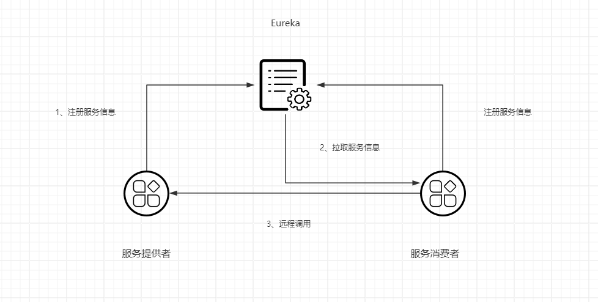
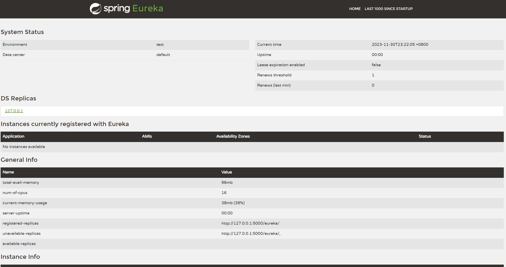
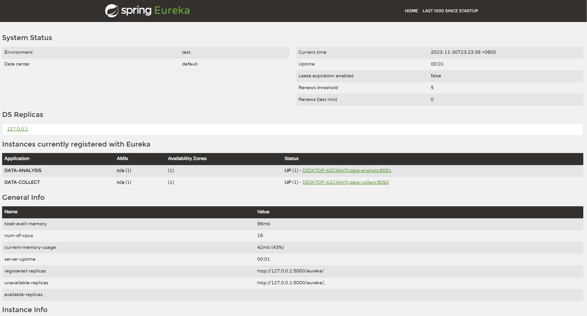

## Eureka注册中心

### 1 远程调用的问题

- 硬编码 （url）
- 分布式 （负载均衡）
- 服务健康

### 2 Eureka原理

- Eureka服务端作用（注册中心、记录服务信息、心跳监控）
- Eureka客户端作用（服务提供者、服务消费者）



- 消费者该如何获取服务提供者的具体消息？\
  服务提供者启动时向Eureka注册自己的信息\
  Eureka会保存这些信息\
  消费者根据服务名称向Eureka拉取这些提供者的信息
- 如果有多个服务提供者，消费者应该如何选择？\
  服务消费者根据负载均衡算法，从服务列表中选一个
- 消费者如何感知提供者的健康状态？\
  服务提供者每隔30s向Eureka发送心跳请求，报告健康状态\
  Eureka会更新记录服务列表信息，心跳不正常会被剔除\
  消费者就可以拉到最新的信息

### 3 搭建eurekaServer

- 1 父工程引入cloud pom依赖

```xml

<dependencyManagement>
    <dependencies>

        <dependency>
            <groupId>org.springframework.cloud</groupId>
            <artifactId>spring-cloud-dependencies</artifactId>
            <version>2022.0.3</version>
            <type>pom</type>
            <scope>import</scope>
        </dependency>
    </dependencies>
</dependencyManagement>
```

- 2 eureka server引入依赖

```xml

<dependency>
    <groupId>org.springframework.cloud</groupId>
    <artifactId>spring-cloud-starter-netflix-eureka-server</artifactId>
</dependency>
```

- 3 配置yml文件

```yaml
server:
  port: 5000

spring:
  application:
    name: data-eureka-server
eureka:
  client:
    service-url:
      defaultZone: http://127.0.0.1:5000/eureka/
    fetch-registry: false
    register-with-eureka: false

```

- 4 开启注解

```java
package com.nil.dataeureka;

import org.springframework.boot.SpringApplication;
import org.springframework.boot.autoconfigure.SpringBootApplication;
import org.springframework.cloud.netflix.eureka.server.EnableEurekaServer;

@EnableEurekaServer
@SpringBootApplication
public class DataEurekaApplication {

    public static void main(String[] args) {
        SpringApplication.run(DataEurekaApplication.class, args);
    }

}

```

- 5 eureka



### 4 服务注册

- 1 服务工程引入依赖

```xml

<dependency>
    <groupId>org.springframework.cloud</groupId>
    <artifactId>spring-cloud-starter-netflix-eureka-client</artifactId>
</dependency>
```

- 2 服务工程配置文件进行配置

```yaml
server:
  servlet:
    context-path: /analysis
  port: 8091

spring:
  application:
    name: data-analysis
  datasource:
    driver-class-name: com.mysql.cj.jdbc.Driver
    url: jdbc:mysql://localhost:3306/cloud_analysis?serverTimezone=GMT&useUnicode=true&characterEncoding=utf-8&useSSL=true
    username: root
    password: root
    druid:
      max-active: 100

eureka:
  client:
    service-url:
      defaultZone: http://127.0.0.1:5000/eureka/

mybatis-plus:
  mapper-locations: classpath:mapper/*.xml
  configuration:
    map-underscore-to-camel-case: true
    log-impl: org.apache.ibatis.logging.stdout.StdOutImpl #打印sql语句便于调试


logging:
  level:
    com.nil: debug
  pattern:
    dateformat: MM-dd HH:mm:ss:SSS
```

- 3 eureka server查看注册列表



### 5 服务发现

- 1 配置restTemplate

```java
package com.nil.datacollect.config;

import org.springframework.cloud.client.loadbalancer.LoadBalanced;
import org.springframework.context.annotation.Bean;
import org.springframework.context.annotation.Configuration;
import org.springframework.web.client.RestTemplate;

@Configuration
public class RestTemplateConfig {

    /**
     * @LoadBalanced 负载平衡
     * 实现eureka进行实例http远程调用
     *
     * @return RestTemplate
     */
    @Bean(name = "rpc")
    @LoadBalanced
    public RestTemplate getRpcRestTemplate() {
        return new RestTemplate();
    }


    /**
     * 普通http调用
     *
     * @return RestTemplate
     */
    @Bean(name = "http")
    public RestTemplate getRestTemplate() {
        return new RestTemplate();
    }
}

```

- 2 替换ip和端口

```java
package com.nil.datacollect.service.impl;

import com.baomidou.mybatisplus.core.conditions.query.LambdaQueryWrapper;
import com.baomidou.mybatisplus.core.toolkit.Wrappers;
import com.nil.datacollect.entity.CheckResult;
import com.nil.datacollect.entity.Experiment;
import com.nil.datacollect.entity.ExperimentVO;
import com.nil.datacollect.mapper.ExperimentMapper;
import com.nil.datacollect.service.ExperimentService;
import lombok.extern.slf4j.Slf4j;
import org.springframework.beans.BeanUtils;
import org.springframework.beans.factory.annotation.Qualifier;
import org.springframework.http.ResponseEntity;
import org.springframework.stereotype.Service;
import org.springframework.web.client.RestTemplate;

import java.util.List;

@Slf4j
@Service
public class ExperimentServiceImpl implements ExperimentService {


    private final ExperimentMapper mapper;

    private final RestTemplate restTemplate;

    private final RestTemplate rpcTemplate;

    public ExperimentServiceImpl(ExperimentMapper mapper, @Qualifier("http") RestTemplate restTemplate, @Qualifier("rpc") RestTemplate rpcTemplate) {
        this.mapper = mapper;
        this.restTemplate = restTemplate;
        this.rpcTemplate = rpcTemplate;
    }

    @Override
    public List<Experiment> getExperiments() {
        LambdaQueryWrapper<Experiment> queryWrapper = Wrappers.lambdaQuery();
        return mapper.selectList(queryWrapper);
    }

  /**
   * 普通http调用实现
   * 
   * @param id id
   * @return ExperimentVO
   */
  @Override
    public ExperimentVO getExperimentInfo(Integer id) {
        LambdaQueryWrapper<Experiment> queryWrapper = Wrappers.lambdaQuery();
        queryWrapper.eq(Experiment::getExperimentId, id);
        Experiment experiment = mapper.selectOne(queryWrapper);
        ExperimentVO experimentVO = new ExperimentVO();
        BeanUtils.copyProperties(experiment, experimentVO);
        String url = "http://localhost:8091/analysis/check/" + experimentVO.getExperimentId();
        ResponseEntity<CheckResult> forEntity = restTemplate.getForEntity(url, CheckResult.class);
        experimentVO.setResult(forEntity.getBody());
        return experimentVO;
    }

  /**
   * eureka 负载均衡http调用
   * 
   * @param id id
   * @return ExperimentVO
   */
  @Override
    public ExperimentVO getExperimentInfoByEureka(Integer id) {
        LambdaQueryWrapper<Experiment> queryWrapper = Wrappers.lambdaQuery();
        queryWrapper.eq(Experiment::getExperimentId, id);
        Experiment experiment = mapper.selectOne(queryWrapper);
        ExperimentVO experimentVO = new ExperimentVO();
        BeanUtils.copyProperties(experiment, experimentVO);
        String url = "http://data-analysis/analysis/check/" + experimentVO.getExperimentId();
        ResponseEntity<CheckResult> forEntity = rpcTemplate.getForEntity(url, CheckResult.class);
        experimentVO.setResult(forEntity.getBody());
        return experimentVO;
    }
}

```