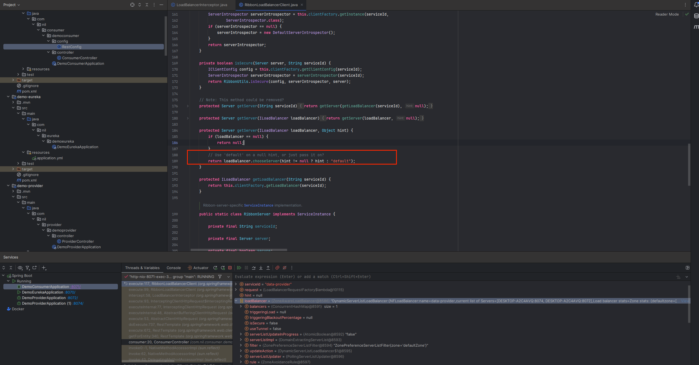

## Ribbon负载均衡

### 1 负载均衡原理

- 1 在spring实例化RestTemplate时，因RestTemplate继承InterceptingHttpAccessor，会设置List<ClientHttpRequestInterceptor>。


- 2 LoadBalancerInterceptor拦截http请求


- 3 获取服务实例 getInstance


- 4 负载均衡



- 5 负载均衡规则


- 6 策略实现按照线性轮询的方式依次选择每个服务实例的功能，这也是Ribbon的默认使用策略


- 7 PredicateBasedRule


### 2 负载均衡策略

Ribbon的负载均衡规则是一个叫做IRule接口来定义的，每一个子接口都是一个规则

- IRule及其实现


- 负载均衡策略

| 内置负载均衡规则类                 | 规则说明                                                                                                                                                                                                                                    |
|---------------------------|-----------------------------------------------------------------------------------------------------------------------------------------------------------------------------------------------------------------------------------------|
| RoundRobinRule            | 简单轮询服务列表来选择服务器。它是ribbon默认的负载规则。                                                                                                                                                                                                         |
| AvailabilityFilteringRule | 对以下两种服务器进行忽略：<br/>（1）在默认情况下，这台服务器3次连接失败，这台服务器会被设置为短路状态。短路状态将持续30s，如果再次连接失败，短路的持续时间会几何级的增加。<br/>（2）并发数过高的服务器。如果一个服务器并发连接次数过高，配置了AvailabilityFilteringRule也会将其忽略。并发数的上限可以由客户端的clientName.clientConfigNameSpace.ActiveConnectsLimit 属性进行配置 |
| WeightedResponseTimeRule  | 为每一个服务器赋予一个权重值。服务器响应时间越长，这个服务器的权重就越小，这个规则会随机选择服务器，这个权重值会影响服务器的选择                                                                                                                                                                        |
| RetryRule                 | 重试机制的选择逻辑                                                                                                                                                                                                                               |
| RandomRule                | 随机选择一个可用的服务器                                                                                                                                                                                                                            |
| BestAvailableRule         | 忽略那些短路的服务器，并且选择并发数较低的服务器                                                                                                                                                                                                                |
| ZoneAvoidanceRule         | 以区域可用的服务器为基础进行服务器的选择。使用Zone对服务器进行分类，这个Zone可以理解为一个机房，一个机架等，然后对Zone内的多个服务做轮询                                                                                                                                                              |

- 自定义Rule
  1、注入规则(统一规则)

```java
package com.nil.consumer.democonsumer.config;

import com.netflix.loadbalancer.IRule;
import com.netflix.loadbalancer.RandomRule;
import org.springframework.context.annotation.Bean;
import org.springframework.context.annotation.Configuration;

@Configuration
public class LoadBalancerRule {

    @Bean
    public IRule randomRule() {
        return new RandomRule();
    }
}

```


2、配置文件（针对服务而言的）

```yaml
server:
  port: 8071

eureka:
  client:
    service-url:
      defaultZone: http://127.0.0.1:8070/eureka/

spring:
  application:
    name: data-consumer

data-provider:
  ribbon:
    NFLoadBalancerRuleClassName: com.netflix.loadbalancer.RoundRobinRule

```


### 3 懒加载

ribbon默认是采用懒加载，即第一次访问时才会创建LoadBalanceClient，请求时间会很长。而且饥饿则会在项目启动时创建，降低第一次访问的耗时，通过下面的配置开启饥饿加载：

```yaml

server:
  port: 8071

eureka:
  client:
    service-url:
      defaultZone: http://127.0.0.1:8070/eureka/

spring:
  application:
    name: data-consumer

data-provider:
  ribbon:
    NFLoadBalancerRuleClassName: com.netflix.loadbalancer.RoundRobinRule

ribbon:
  eager-load:
    clients: 
      - data-provider # 指定服务
      - data-monitor # 监控服务
    enabled: true  # 开启饥饿加载


```

### 4 LoadBalancer

Ribbon在Spring cloud 2020.0.0中标记为不推荐使用
并在Spring cloud 2021.0.0版本中被移除，推荐使用Spring cloud LoadBalancer来实现负载均衡

spring官方支持了两种负载均衡的客户端：

- RestTemplate：
  RestTemplate是spring提供的用于访问restful服务的客户端，RestTemplate提供了多种便携访问远程http服务的方法，能够大大的提高客户端的编写效率，默认情况下，RestTemplate依赖于默认的JDK的HTTP连接工具。
- WebClient：
  WebClient是spring
  webflux5.0版本开始提供的一个非阻塞的基于响应式编程的进行HTTP请求的客户端工具。它的响应式编程是基于Reactor的。WebClient中提供了标准http请求对应的get、post、put、delete等方法，可以用来发起相应的请求。

### 5 Spring Boot和Spring Cloud版本对应关系表

| Spring Boot版本            | Spring Cloud版本 |
|--------------------------|----------------|
| 3.0.0-M2-3.1.0-M1  （不包括） | 2022.0.0-M2    |
| 3.0.0-M1- 3.0.0-M2 （不包括） | 2022.0.0-M1    |
| 2.6.1 and -3.0.0-M1（不包括） | 2021.0.3       |
| 2.6.0-RC1-2.6.1（不包括）     | 2021.0.0-RC1   |
| 2.6.0-M3- 2.6.0-RC1（不包括） | 2021.0.0-M3    |
| 2.6.0-M1-2.6.0-M3 （不包括）  | 2021.0.0-M1	   |
| 2.5.x                    | 2020.0.x       |
| 2.4.x                    | 2020.0.x       |
| 2.3.x                    | Hoxton.SR10    |
| 2.2.x                    | Greenwich.SR6  |
| 2.1.x                    | Finchley.SR3   |
| 2.0.x                    | Edgware.SR4    |
| 1.5.x                    | Dalston.SR5    |
